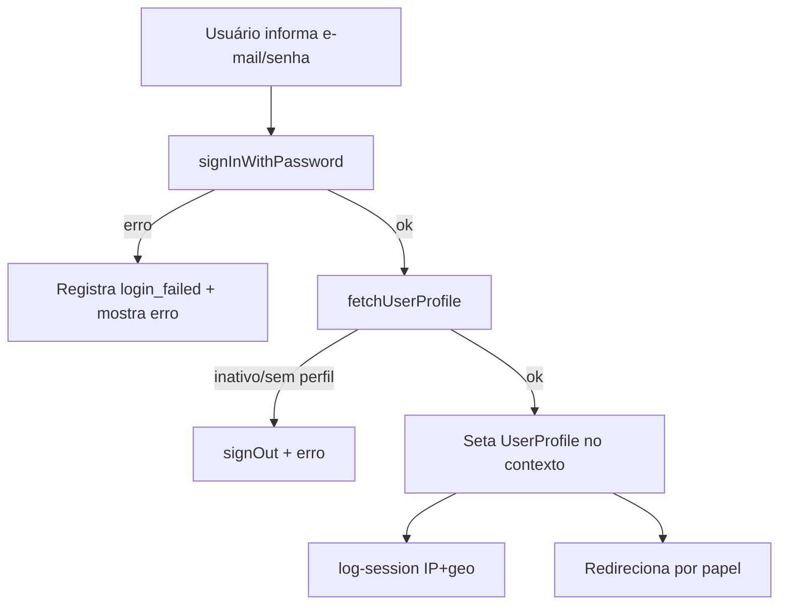
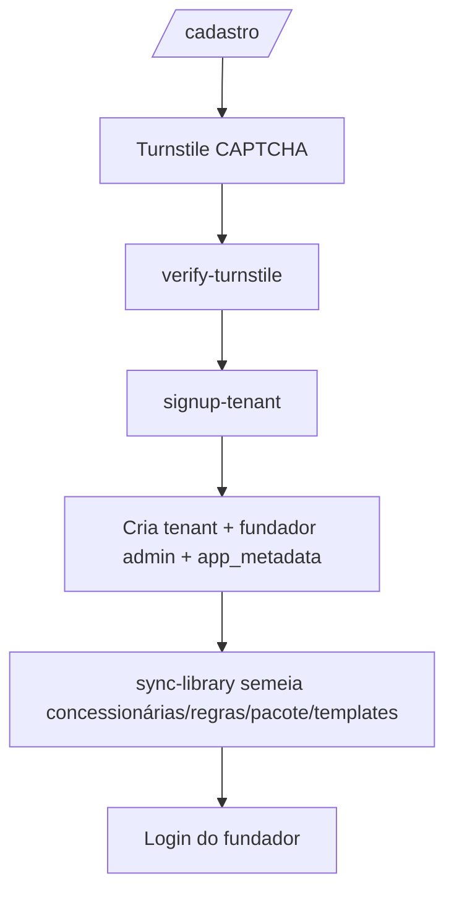

# Autenticação — Fluxos

## Login

```mermaid
flowchart TD
  A[Usuário informa e-mail/senha] --> B[signInWithPassword]
  B -->|erro| E[Registra login_failed + mostra erro]
  B -->|ok| C[fetchUserProfile]
  C -->|inativo/sem perfil| D[signOut + erro]
  C -->|ok| F[Seta UserProfile no contexto]
  F --> G[log-session IP+geo]
  F --> H[Redireciona por papel]
```

## Autocadastro de tenant

```mermaid
flowchart TD
  A[/cadastro/] --> B[Turnstile CAPTCHA]
  B --> C[verify-turnstile]
  C --> D[signup-tenant]
  D --> E[Cria tenant + fundador admin + app_metadata]
  E --> F[sync-library semeia concessionárias/regras/pacote/templates]
  F --> G[Login do fundador]
```
