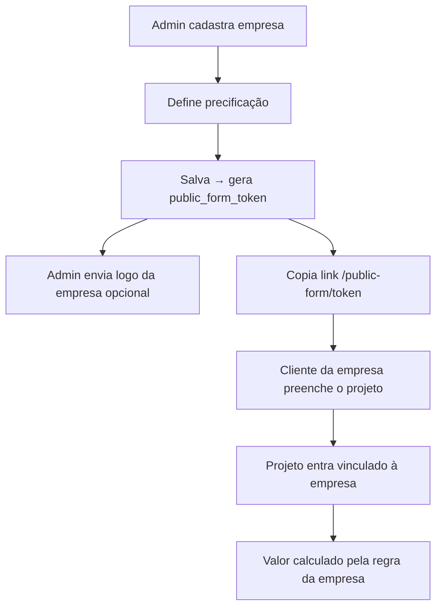
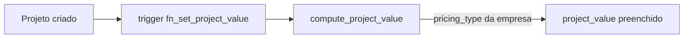

# Empresas — Fluxos

## Cadastro e link público

```mermaid
flowchart TD
  A[Admin cadastra empresa] --> B[Define precificação]
  B --> C[Salva → gera public_form_token]
  C --> D[Admin envia logo da empresa opcional]
  C --> E[Copia link /public-form/token]
  E --> F[Cliente da empresa preenche o projeto]
  F --> G[Projeto entra vinculado à empresa]
  G --> H[Valor calculado pela regra da empresa]
```

## Precificação → valor do projeto

```mermaid
flowchart LR
  P[Projeto criado] --> T[trigger fn_set_project_value]
  T --> C[compute_project_value]
  C -->|pricing_type da empresa| V[project_value preenchido]
```
