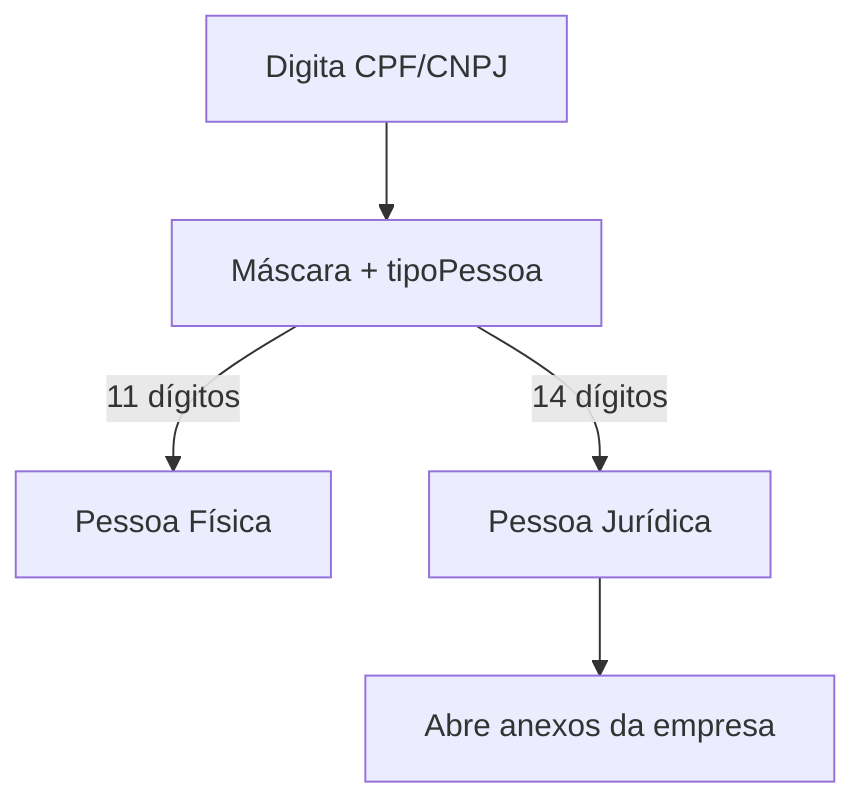

# Módulo: Titulares / Clientes

> **Mapeamento:** no domínio deste sistema, "cliente" tem dois sentidos. A
> **empresa integradora** é documentada em [companies](../companies/overview.md).
> Aqui tratamos do **titular** — o dono da unidade consumidora do projeto. O
> titular **não é** um usuário do sistema; é um dado do projeto.

## Objetivo
Registrar e validar os dados do titular da UC (pessoa física ou jurídica) que
constam no projeto e nos documentos gerados.

## Onde vive
- Dados: `project_general_data` (`holder_name`, `holder_cpf_cnpj`,
  `holder_email`, `holder_phone`, endereço, `uc_number`).
- Lógica de CPF/CNPJ: `src/lib/cpfCnpj.ts`.

## Regras de negócio
- **Tipo de pessoa** deduzido pela quantidade de dígitos: 11 = física, 14 =
  jurídica. Envio exige número completo (mensagem informa o que falta).
- **Pessoa jurídica** abre anexos da empresa (opcionais, com aviso): cartão
  CNPJ, contrato social, documento do responsável legal, procuração
  (`document_type`: `cnpj_card`, `social_contract`, `legal_rep_document`,
  `power_of_attorney`).
- **Limitação atual**: valida só o **tamanho** do número, não os dígitos
  verificadores (ver roadmap).

## Fluxo

