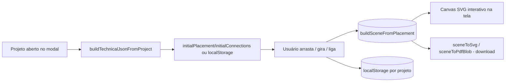

# Módulo: Diagramas

**Estado: 🟡 Alpha interno** — visível só para o **master**, operando sobre os
projetos do próprio tenant do master (GD Manager). Não disponível para os
demais tenants ainda.

## Duas interpretações (contexto histórico)
Este item da estrutura padrão tinha duas leituras possíveis:
1. Diagramas de arquitetura/fluxo (documentação) — já cobertos por Mermaid nos
   `.md` deste repositório.
2. **Diagrama unifilar elétrico do projeto** (feature de produto) — é este que
   está descrito abaixo.

## Objetivo
Gerar o **diagrama unifilar** (esquema elétrico simplificado: geração →
conversão → proteção → medição → rede) a partir dos dados já cadastrados do
projeto, como uma cartilha adicional exportável em SVG/PDF.

## Arquitetura
Existe uma proposta completa (motor de layout automático, roteamento
ortogonal, biblioteca de símbolos versionada, exportador DXF, editor visual
drag-and-drop) em `DIAGRAMA UNIFILAR/cad-engine-arquitetura.md`, fora do
repositório do app. O que está implementado hoje incrementa uma **fatia
vertical** dessa proposta com edição manual interativa — o
`ManualLayoutSource` do §17.2, construído **antes** do motor de layout
automático (inversão deliberada da ordem do roadmap original, decidida com o
usuário: útil mais cedo, e o motor automático continua no roadmap):

| Peça da proposta | Nesta fatia |
|---|---|
| Pacote isolado `packages/cad-engine/` (monorepo) | Módulo comum em `src/utils/cadEngine/` — este repo não é monorepo |
| Motor de layout automático (grafo, ranking, roteador ortogonal) | Ainda não construído. Existe um **layout fixo inicial** (fileira única) como ponto de partida, editável manualmente por cima. |
| `ManualLayoutSource` (§17.2) — layout desenhado pelo usuário | **Implementado**: arrastar (clique em qualquer ponto da figura, não só no traço — ver nota abaixo), girar em passos de 90°, ligar dois componentes manualmente. Condutores sem pontos de dobra usam roteamento **ortogonal simplificado** (`orthogonalPath`); com pontos de dobra adicionados manualmente (`waypoints`, arrastando o traço ou um ponto já criado), a linha segue exatamente o caminho desenhado (`computeConnectorPoints`) — ainda não é o roteador com detecção de cruzamento da proposta. |
| Biblioteca de símbolos declarativa versionada | 5 símbolos fixos (`symbols.ts`), aproximados de IEC 60617. Todos desenhados no eixo horizontal (`y = H/2`), para alinhar com o fluxo esquerda→direita do diagrama e com os pontos de conexão (`edgePoint`) — o disjuntor (chave de abertura) foi redesenhado nesse sentido depois de sair vertical na primeira versão. |
| Exportadores SVG / PDF / DXF / PNG via IR neutra | **SVG e PDF**, ambos consumindo a mesma `Scene` (IR já segue o princípio D1: um exportador novo não toca em layout/símbolos) |
| JSON Técnico completo (grafo elétrico genérico) | `TechnicalJsonMvp`: cadeia fixa PV → Inversor → Disjuntor → Medidor → Rede, montada a partir de `project_equipment`/`project_general_data` do próprio projeto |
| `DiagramTemplate` — salvar/aplicar layout como template (§17.3) | Não implementado ainda — ver roadmap |

## Arquivos
- `src/utils/cadEngine/types.ts` — `TechnicalJsonMvp` + Scene IR (subconjunto de D1; `BlockInstance.rotation`).
- `src/utils/cadEngine/symbols.ts` — definições geométricas dos 5 símbolos.
- `src/utils/cadEngine/paper.ts` — constantes de papel/margem + moldura/carimbo (compartilhado entre o layout fixo e o editável).
- `src/utils/cadEngine/buildTechnicalJson.ts` — projeto → JSON técnico (reaproveita `buildProjectValues`).
- `src/utils/cadEngine/layout.ts` — JSON técnico → `Scene` com layout fixo (posição inicial, antes de qualquer edição).
- `src/utils/cadEngine/editableLayout.ts` — `PlacedSymbol`/`ManualConnection` (com `waypoints?: Point[]`), `orthogonalPath`, `computeConnectorPoints` (roteamento automático sem pontos de dobra, ou caminho manual exato quando há), `snapToGrid`, `buildSceneFromPlacement` (a `Scene` a partir do estado editado).
- `src/utils/cadEngine/exportSvg.ts` / `exportPdf.ts` — `Scene` → SVG / PDF, com suporte a `rotation` do bloco (PDF gira os pontos manualmente; SVG usa `transform="rotate(...)"` nativo). PDF via `jspdf`, já usado em `resumoPdf.ts` — nenhuma dependência nova.
- `src/components/projects/UnifilarTab.tsx` — canvas SVG interativo (arrastar/girar/ligar) + botões de download.

## Permissões
Aba "Unifilar" no `ProjectModal`, gateada por `user?.isMaster` no front. Como o
master, no app normal, só vê o próprio tenant (ADR 0005 — sem bypass de RLS), e
o tenant do master é a GD Manager, o gate por `isMaster` já restringe
naturalmente a escala inicial pedida ("apenas master, empresa GD Manager") sem
precisar de RLS/RPC nova — os dados consumidos (`project_equipment`,
`project_general_data`) já são os do próprio projeto aberto no modal.

## Persistência
O layout editado (posições, rotações, ligações manuais) é salvo em
**`localStorage`**, por projeto (`unifilar-layout:{projectId}`) — **só neste
navegador**, não sincroniza entre dispositivos/usuários e não é um
`DiagramTemplate` reutilizável. Ao reabrir a aba, o estado salvo é reconciliado
com os componentes atuais do projeto (`reconcile()` em `UnifilarTab.tsx`):
ids que não existem mais são descartados; componentes novos entram na posição
padrão da fileira.

## Nota técnica — arrastar símbolos com `fill="none"`
Os primitivos dos símbolos são desenhados com `fill="none"` (só contorno). Em
SVG, uma forma sem preenchimento só recebe eventos de mouse **exatamente em
cima do traço**, não no interior da figura — clicar no meio de um símbolo
"vazio" não disparava o `mousedown` de arrastar. Corrigido com um `<rect>`
invisível (`fill="transparent"`, do tamanho da caixa 24×20mm) como primeiro
filho do `<g>` arrastável de cada símbolo: preenchimento transparente ainda
é "pintado" para fins de hit-test do navegador, então captura clique em
qualquer ponto da caixa e propaga para o handler do grupo.

## Fluxo

## Limitações desta fatia (deliberadas)
- Só a cadeia PV→Inversor→Disjuntor→Medidor→Rede — sem BESS, sem múltiplos
  inversores/QDCs, sem geração compartilhada.
- Sem motor de layout automático/roteador com detecção de cruzamento — sem
  pontos de dobra manuais, o roteamento é um Manhattan de 2 segmentos simples;
  com pontos de dobra, o usuário desenha o caminho à mão, sem ajuda automática
  (sem ortogonalização, sem desvio de outros traços/símbolos).
- Símbolos aproximados; **pendente calibrar** com unifilares reais aprovados da
  GD Manager (combinado com o usuário — ele vai enviar exemplos).
- Sem exportador DXF, sem `DiagramTemplate` (salvar/aplicar layout em outro
  projeto).
- Layout persiste só em `localStorage` deste navegador — não sincroniza entre
  quem usa o sistema, e some se o navegador for trocado ou o storage limpo.
- Só o master vê; outros tenants não têm acesso ainda.

## Melhorias futuras
Ver a proposta completa em `DIAGRAMA UNIFILAR/cad-engine-arquitetura.md` para o
plano em etapas (motor de layout automático, roteamento, DXF, templates
reutilizáveis, editor visual, regras por concessionária, liberação para
outros tenants). Ver também [ADR 0006](../../adr/0006-cad-engine-alpha.md).
