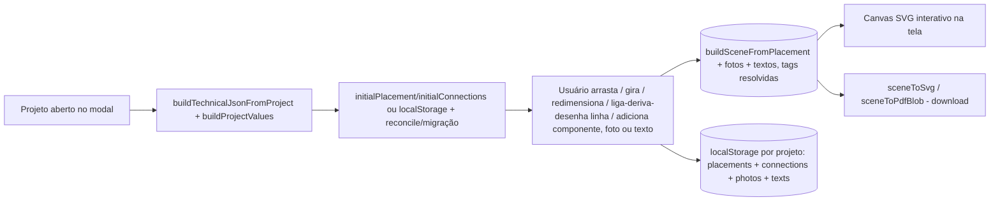

# Módulo: Diagramas

**Estado: 🟡 Alpha interno** — restrito por enquanto ao tenant GD Manager
(`tenants.is_library = true`), para os papéis **admin** e **staff**
(`useDiagramEngineAccess()`). Não disponível para os demais tenants ainda,
nem para o papel `company`.

Duas telas, um editor compartilhado:
- **Dentro do modal do projeto** (`UnifilarTab.tsx`) — o diagrama daquele
  projeto específico, com os 5 componentes do cadastro real; edição fica só
  no `localStorage` deste navegador.
- **Motor de templates** (`/admin/diagram-templates`, aba própria no menu) —
  monta/salva **modelos reutilizáveis** de diagrama, persistidos no banco
  (`diagram_templates`), pra depois importar num projeto em vez de montar do
  zero. Editar um modelo aqui nunca afeta o que já foi editado dentro de um
  projeto, e vice-versa — são estados completamente separados.

Os dois usam o **mesmo componente de canvas** (`DiagramEditor.tsx`,
`src/components/diagrams/`) — arrastar/girar/redimensionar/ligar funciona
identicamente nos dois lugares.

## Duas interpretações (contexto histórico)
Este item da estrutura padrão tinha duas leituras possíveis:
1. Diagramas de arquitetura/fluxo (documentação) — já cobertos por Mermaid nos
   `.md` deste repositório.
2. **Diagrama unifilar elétrico do projeto** (feature de produto) — é este que
   está descrito abaixo.

## Objetivo
Gerar o **diagrama unifilar** (esquema elétrico simplificado: geração →
conversão → proteção → medição → rede) a partir dos dados já cadastrados do
projeto, como uma cartilha adicional exportável em SVG/PDF.

## Arquitetura
Existe uma proposta completa (motor de layout automático, roteamento
ortogonal, biblioteca de símbolos versionada, exportador DXF, editor visual
drag-and-drop) em `DIAGRAMA UNIFILAR/cad-engine-arquitetura.md`, fora do
repositório do app. O que está implementado hoje incrementa uma **fatia
vertical** dessa proposta com edição manual interativa — o
`ManualLayoutSource` do §17.2, construído **antes** do motor de layout
automático (inversão deliberada da ordem do roadmap original, decidida com o
usuário: útil mais cedo, e o motor automático continua no roadmap):

| Peça da proposta | Nesta fatia |
|---|---|
| Pacote isolado `packages/cad-engine/` (monorepo) | Módulo comum em `src/utils/cadEngine/` — este repo não é monorepo |
| Motor de layout automático (grafo, ranking, roteador ortogonal) | Ainda não construído. Existe um **layout fixo inicial** (fileira única) como ponto de partida, editável manualmente por cima. |
| `ManualLayoutSource` (§17.2) — layout desenhado pelo usuário | **Implementado**: arrastar (clique em qualquer ponto da figura, não só no traço — ver nota abaixo), girar em passos de 90°, **redimensionar** (arrastar o quadrado azul do canto), ligar/desenhar linhas com derivações e pontas soltas, selecionar e arrastar uma linha inteira como bloco. Condutores sem pontos de dobra usam roteamento **ortogonal simplificado** (`orthogonalPath`); com pontos de dobra (`waypoints`), a linha segue exatamente o caminho desenhado (`computeConnectorPoints`) — ver "Ligar / desenhar linha" abaixo. |
| Biblioteca de símbolos declarativa versionada | 12 símbolos fixos (`symbols.ts`), aproximados de IEC 60617 e calibrados contra a legenda de dois diagramas reais (ENEL) enviados pelo usuário como referência: arranjo FV, inversor, disjuntor **bipolar**, disjuntor **tripolar**, chave CC, medidor **convencional**, medidor **bidirecional**, rede, DPS, fusível, aterramento e quadro de distribuição. A maioria fica no eixo horizontal (`y = H/2`), alinhada ao fluxo esquerda→direita; DPS/aterramento são verticais (derivação para o terra, não em série). |
| Componentes fora da cadeia fixa do projeto | **Implementado, mas só visual**: qualquer um dos 6 tipos pode ser adicionado livremente ao diagrama (paleta "Adicionar"), sem precisar existir no cadastro do projeto — útil para representar um 2º inversor, um DPS, um disjuntor extra etc. Não altera `project_equipment` nem qualquer dado do projeto. |
| Fotos no diagrama | **Implementado**: upload de uma imagem (comprimida no cliente), vira um bloco arrastável/redimensionável no canvas, sai impressa no SVG/PDF exportado. Não faz parte da `Scene` "elétrica" — é uma camada `PHOTO` à parte. |
| Texto/legenda livre no diagrama | **Implementado**: bloco de texto solto (`PlacedText`), arrastável, editável por duplo-clique. Tanto ele quanto a legenda de qualquer componente aceitam tags `{chave}` do **mesmo catálogo dos templates .docx** (`TEMPLATE_VARIABLES`/`buildProjectValues` em `projectValues.ts`) — resolvidas ao vivo no canvas e no export, não gravadas como valor fixo. |
| Exportadores SVG / PDF / DXF / PNG via IR neutra | **SVG e PDF**, ambos consumindo a mesma `Scene` (IR já segue o princípio D1: um exportador novo não toca em layout/símbolos). `Primitive` ganhou a variante `image` para as fotos; `BlockInstance` ganhou `scale` (símbolos redimensionáveis). |
| JSON Técnico completo (grafo elétrico genérico) | `TechnicalJsonMvp`: cadeia fixa PV → Inversor → Disjuntor → Medidor → Rede, montada a partir de `project_equipment`/`project_general_data` do próprio projeto. Componentes adicionados manualmente (acima) não entram nesse JSON — só existem no layout salvo. |
| `DiagramTemplate` — salvar/aplicar layout como template (§17.3) | **MVP implementado**: tabela `diagram_templates` (banco, tenant-isolada), aba própria (`/admin/diagram-templates`) pra montar/salvar modelos manualmente (ou **importar de um PDF**, ver "Reconhecimento automático" abaixo), com o mesmo `DiagramEditor`. Ainda **não tem**: importar um modelo salvo dentro do modal do projeto (falta esse elo), nem casamento automático por critério (§17.3 fala em match `exact`/`parametric` — aqui é 100% manual). |

## Arquivos
- `src/utils/cadEngine/types.ts` — `TechnicalJsonMvp` + Scene IR (subconjunto de D1; `BlockInstance.rotation`; `Primitive` inclui `image`; `LayerId` inclui `PHOTO`).
- `src/utils/cadEngine/symbols.ts` — definições geométricas dos 6 símbolos + `KIND_LABEL` (nome curto por tipo, usado na paleta "Adicionar") + `CONNECTION_INSET` (recuo em mm entre a caixa e a ponta real do traço de cada símbolo — usado por `edgePoint()`).
- `src/utils/cadEngine/paper.ts` — constantes de papel/margem + moldura/carimbo (compartilhado entre o layout fixo e o editável).
- `src/utils/cadEngine/buildTechnicalJson.ts` — projeto → JSON técnico (reaproveita `buildProjectValues`).
- `src/utils/cadEngine/layout.ts` — JSON técnico → `Scene` com layout fixo (posição inicial, antes de qualquer edição).
- `src/utils/cadEngine/editableLayout.ts` — `PlacedSymbol` (com `scale`), `ManualConnection` (`from`/`to` são `ConnectionEndpoint` — `{kind:'symbol',id}` ou `{kind:'point',at}` —, mais `waypoints?: Point[]`), `PlacedPhoto`, `PlacedText`, `orthogonalPath`, `computeConnectorPoints` (aceita qualquer combinação de pontas symbol/point; `edgePoint()` interno recua pelo `CONNECTION_INSET`), `isConnectionResolvable`, `blockCenter` (considera a escala), `findNearestSymbol`/`nearestPointOnPolyline`/`SNAP_RADIUS` (snapping de clique/soltura pra componente ou linha perto o bastante), `snapToGrid`, `buildSceneFromPlacement` (a `Scene` a partir do estado editado + fotos + textos, resolvendo tags via `tagValues`), `buildSceneFromRecognition`/`layoutFromRecognition` (resultado da IA de reconhecimento → `DiagramSceneState`: fileira principal por `stage` + derivações `branch` empilhadas na mesma coluna, ver "Reconhecimento automático a partir de PDF" abaixo).
- `src/utils/cadEngine/exportSvg.ts` / `exportPdf.ts` — `Scene` → SVG / PDF, com suporte a `rotation`/`scale` do bloco (PDF transforma os pontos manualmente — escala em torno do centro, depois gira, mesma ordem em ambos; SVG usa `transform="...rotate()...scale()..."` nativo via `blockTransform()`, reaproveitado ao vivo pelo canvas) e à primitiva `image` (SVG: `<image href>`; PDF: `doc.addImage`, formato detectado pelo prefixo do data URL). PDF via `jspdf`, já usado em `resumoPdf.ts` — nenhuma dependência nova.
- `src/utils/projectValues.ts` — `resolveProjectTags(texto, values)`: substitui `{chave}` usando o mesmo catálogo `TEMPLATE_VARIABLES`/`buildProjectValues` dos templates .docx; tag desconhecida fica como está. `buildSampleValues()` (já existia, reaproveitado) gera dados fictícios pra prévia dos modelos.
- `src/components/diagrams/DiagramEditor.tsx` — canvas SVG interativo compartilhado (arrastar/girar/redimensionar/ligar-e-desenhar-com-derivação/selecionar-e-arrastar-linha-inteira/adicionar componente, foto ou texto) + botões de download. Não sabe de onde vêm os dados nem pra onde vão — recebe `json`/`initialState`/`tagValues` e devolve cada mudança via `onStateChange`; quem chama decide onde persistir.
- `src/components/projects/UnifilarTab.tsx` — usa o `DiagramEditor` com os dados do projeto real; persiste em `localStorage` por projeto; tem a lógica de `reconcile()`/migração de formato antigo.
- `src/pages/admin/DiagramTemplates.tsx` — motor de templates: lista de modelos (criar/renomear/duplicar/excluir) e, ao abrir um, usa o mesmo `DiagramEditor` com `json.components = []` (modelo começa vazio, sem cadeia fixa — todo símbolo nasce com prefixo `manual-`) e autosave debounced (800ms) em `diagram_templates.scene_data`.
- `src/hooks/useDiagramTemplates.ts` — CRUD via React Query (`useDiagramTemplates`, `useCreateDiagramTemplate`, `useUpdateDiagramTemplate`, `useDeleteDiagramTemplate`, `useDuplicateDiagramTemplate`).
- `src/hooks/useDiagramEngineAccess.ts` — regra de acesso única, reaproveitada no menu lateral, na rota e na aba do modal do projeto.
- `src/hooks/useDiagramRecognition.ts` — chama a edge function `diagram-recognize` (upload → base64 → IA de visão → lista de componentes/ligações).
- `supabase/functions/diagram-recognize/index.ts` — edge function (mesmo padrão do `claudinho-verifica`: Anthropic API, PDF nativo via `anthropic-beta: pdfs-2024-09-25`, `consume_ai_quota`).

## Permissões
`useDiagramEngineAccess()`: papel `admin` ou `staff` **e** tenant
`is_library = true` (hoje só a GD Manager — reaproveita o mesmo flag da
tabela `tenants` que já marca a origem da biblioteca de concessionárias
copiada pros demais tenants no cadastro, ver
[modules/integrations](../integrations/overview.md) sobre `sync-library`).
`company` nunca tem acesso.
O master, cujo papel é `admin` e cujo tenant é a GD Manager, já cai nessa
regra sem precisar de caso especial (ADR 0005 — master não tem bypass de
RLS, opera como qualquer usuário do próprio tenant). Usado em três lugares:
item "Diagramas (modelos)" no menu lateral, rota `/admin/diagram-templates`
(dupla checagem — a rota já é protegida por papel via `ProtectedRoute`, mas
a página confere de novo o `is_library`), e a aba "Unifilar" dentro do modal
do projeto. RLS de `diagram_templates` é por `tenant_id` normal (mesmo
padrão de `energy_concessionaires`) — **liberar pra todos os tenants no
futuro é só remover a checagem de `is_library`**, o banco já está pronto.

## Motor de templates (`/admin/diagram-templates`)
Aba própria fora do modal do projeto — "montar um modelo uma vez, reaproveitar
depois", em vez de recriar o diagrama do zero em cada projeto. Duas telas na
mesma página:
- **Lista**: cards com nome/descrição/quantidade de componentes, criar
  (dialog com nome + descrição opcional), renomear (`window.prompt`),
  duplicar, excluir.
- **Editor**: abre um modelo com o mesmo `DiagramEditor` do projeto, mas
  `json.components = []` — o modelo **começa vazio**, sem a cadeia fixa
  PV→Inversor→Disjuntor→Medidor→Rede; todo componente é adicionado pela
  paleta "Adicionar" (por isso todo id de componente de um modelo já nasce
  com o prefixo `manual-`, e a mesma lógica de "componente manual é sempre
  removível" do modo projeto vale aqui sem precisar de nenhum caso especial).
  Salva sozinho: cada mudança de estado dispara um autosave com **debounce de
  800ms** em `diagram_templates.scene_data` (silencioso, sem toast a cada
  letra digitada). Um botão "Pré-visualizar com dados de exemplo" troca entre
  mostrar as tags `{chave}` cruas (o que fica gravado) e resolvidas contra
  `buildSampleValues()` (os mesmos dados fictícios usados no "Testar
  preenchimento" dos templates .docx) — só afeta a tela, não o que é salvo.

**Elo que falta pra fechar o pedido original** ("no modal do projeto, só
apresenta o diagrama, e se quiser editar antes de baixar tem essa opção"):
hoje o modal do projeto **não importa** nenhum modelo salvo aqui — continua
montando o diagrama a partir da cadeia fixa do cadastro, como sempre fez. Os
dois editores reaproveitam o mesmo componente e o mesmo formato de dados
(`DiagramSceneState`), então importar é, em essência, carregar
`template.scene_data` como o `initialState` do `UnifilarTab` em vez do
resultado de `reconcile()` — mas a decisão de **como o usuário escolhe qual
modelo importar** (dropdown manual? por concessionária? por nº de
inversores?) ainda não foi tomada com o usuário. Ver roadmap.

## Reconhecimento automático a partir de PDF
Botão "Importar de PDF" na lista de modelos (`/admin/diagram-templates`): o
usuário sobe um PDF (ou foto) de um diagrama unifilar já aprovado, a edge
function `diagram-recognize` chama a IA de visão (Anthropic, mesmo mecanismo
do Claudinho — `claudinho-verifica`) com o vocabulário fechado dos 12
`ComponentKind` existentes e devolve, por componente: `kind`, rótulo,
**`stage`** (posição inteira no fluxo principal, 0 = geração, crescente até a
rede) e **`branch`** (`true` = derivação — DPS, aterramento — que não fica em
série no condutor principal), além das `connections` entre os ids. Nunca
posição/rotação exata em mm — só essa topologia aproximada (ver "Por que só
topologia" abaixo). `layoutFromRecognition` (`editableLayout.ts`) usa
`stage`/`branch` pra montar uma cena que já se parece com um unifilar de
verdade: componentes `branch: false` do mesmo `stage` ficam na fileira
principal (mesmo `x`), os `branch: true` empilham abaixo, na mesma coluna —
bem mais próximo do pedido original ("o PDF é redesenhado no editor") do que
uma fileira única. O template é criado **num único insert já com essa cena**
(`useCreateDiagramTemplate` aceita `sceneData` opcional) — antes era
criar-vazio-depois-atualizar em duas chamadas, e uma falha na segunda deixava
um modelo órfão e vazio pra trás (bug real, aconteceu na primeira tentativa
real de importação; corrigido). Abre direto no editor com um aviso roxo:
**"reconhecido automaticamente, revise antes de usar"**. Dados pessoais do
documento (titular, endereço, ART, CPF/CNPJ) são explicitamente instruídos a
ficar de fora da resposta — a IA só devolve tipo/rótulo de componente e
conexão, nunca texto livre do documento.

**Por que só topologia (+ stage/branch), sem posição/rotação/coordenadas em
mm:** pedir à IA coordenadas exatas alinhadas à nossa página teria uma taxa
de erro alta demais pra ser útil (LLMs de visão são bons em "o que tem aqui",
"onde mais ou menos fica no fluxo" e "o que conecta com o quê", ruins em
coordenada pixel-perfeita) — o editor manual já existe e é bom o bastante pra
ajustar posição fina depois. `stage`/`branch` é o meio-termo: estrutura
suficiente pra sair parecido com o diagrama real sem depender da IA acertar
geometria exata.

**Robustez contra resposta da IA fora do esperado:** `KIND_ALIASES` (edge
function) normaliza variações comuns que a IA às vezes usa em vez do `kind`
exato (inglês, sinônimo, plural — ex. `"circuit-breaker"` → `breaker`) antes
de validar contra o vocabulário — sem isso, uma resposta quase-certa vira "0
componentes reconhecidos" só por uma string ligeiramente diferente. A edge
function também loga (server-side, `console.log`) a lista bruta de `kind`
devolvida pela IA a cada chamada, e o texto bruto quando zero componentes
sobrevivem à validação — sem esse log, um caso de "reconheceu 0" fica sem
diagnóstico (foi exatamente o que dificultou investigar o primeiro caso real).

Cota de uso: mesma função `consume_ai_quota` do Claudinho (`_kind:
'diagram_recognize'`), registrada em `ai_usage_log` — hoje sem efeito prático
porque o recurso é restrito à GD Manager (plano interno sem limite), mas já
fica com o consumo rastreado se algum dia abrir pra outros tenants.

## Componentes e fotos adicionados manualmente
Além dos 5 componentes que vêm do cadastro do projeto (`TechnicalJsonMvp`), a
paleta "Adicionar" na barra de ferramentas cria uma instância solta de
qualquer um dos 6 tipos (`addComponent()` em `UnifilarTab.tsx`) — o id sempre
começa com `manual-` (ex.: `manual-dps-1721...`). "Adicionar foto" abre um
seletor de arquivo; a imagem é redimensionada/comprimida no navegador (máx.
900px, JPEG ~78% de qualidade) antes de virar `PlacedPhoto` — sem isso, uma
foto de celular sem compressão estouraria a cota do `localStorage` rapidamente.
Ambos são **só visuais**: não criam nem alteram nenhum registro de
`project_equipment`. Só é possível remover (botão "Remover selecionado" /
ícone na foto) o que foi adicionado manualmente — os 5 componentes do
cadastro do projeto são sempre exibidos.

## Ligar / desenhar linha (só componente-a-componente ou com derivação)
Uma ligação **sempre** termina em algo real — um componente ou outra linha —,
nunca fica solta no vazio (decisão explícita do usuário: "não deixe que as
linhas possam ser desenhadas livremente, mas sim, conectando componentes uns
aos outros ou em outras linhas"). A origem e o destino
(`ConnectionEndpoint`) podem ser um **componente** (`{kind:'symbol'}`) ou um
**ponto sobre outra linha existente** (`{kind:'point', at}`, uma derivação —
não há uma referência formal "esta ligação deriva da outra" guardada, é só o
mesmo ponto no espaço, coincidente o bastante pra parecer e funcionar como
uma derivação). Não existe uma terceira opção de "ponto solto sem ligação a
nada".

- Clique num componente → origem/destino é aquele componente.
- Clique em cima de uma linha existente (dentro do raio de captura,
  `SNAP_RADIUS = 6mm`) → origem/destino é o ponto exato sobre ela (derivação).
- Clique **sem estar perto de nenhum dos dois**: se ainda não tem origem
  escolhida, o clique não faz nada (não há como começar uma ligação do
  nada); se já tem origem, vira só mais um ponto de dobra do traço — o meio
  do caminho continua livre pra desenhar por onde quiser, só as **pontas**
  são obrigadas a estar em algo.
- Clicar de novo na própria origem cancela a ligação em andamento (mesmo
  clicando por perto, não exatamente nela). Esc também cancela a qualquer
  momento.

Depois de criada, a linha inteira tem três formas de edição:
- **Selecionar**: clique em qualquer trecho do traço (fica destacada em azul).
- **Mover como bloco**: arraste um trecho selecionado ou não — desloca todos
  os pontos de dobra (e as pontas em derivação, se houver) juntos, mantendo o
  formato. Se a linha ainda não tinha pontos de dobra, o primeiro arrasto
  "semeia" com o roteamento automático atual antes de mover.
- **Ponto a ponto**: duplo-clique no meio de um trecho cria um novo ponto de
  dobra ali; arrastar um ponto de dobra (ou uma ponta em derivação) move só
  ele — ao soltar, a ponta em derivação gruda de novo em componente/linha
  perto o bastante, ou volta pro lugar original se não achar nenhum (nunca
  fica solta no vazio, ver "Alinhamento pixel-a-pixel" abaixo); duplo-clique
  num ponto de dobra remove.
- **Excluir**: com a ligação selecionada, tecla Delete/Backspace, botão
  "Remover selecionado" na barra, ou o ícone de lixeira na lista "Ligações".

## Alinhamento pixel-a-pixel (ligações e componentes)
Dois problemas distintos faziam linha e componente não "encostarem" de
verdade um no outro:
1. **`edgePoint()` mirava a borda vazia da caixa (24×20mm), não a ponta real
   do traço do símbolo.** Cada símbolo tem uma margem própria entre a caixa e
   onde o desenho de fato termina (ex.: o medidor é um círculo de raio 8
   centrado no meio — a borda real fica a 4mm da caixa, não 0). `CONNECTION_INSET`
   (`symbols.ts`) guarda esse recuo por tipo de símbolo (2mm nos traços dos
   demais, 4mm no medidor e na rede — calibrado olhando a geometria de cada
   um), e `edgePoint()` subtrai antes de calcular onde o condutor encosta.
   Sem isso, **toda** ligação símbolo↔condutor da cadeia tinha um gap de
   2–4mm, não só a derivação que apareceu no print do usuário — só ficava
   mais visível nela por causa do ângulo reto e dos marcadores de ponta.
2. **Pontas em derivação não grudavam em nada perto delas.** Ao terminar uma
   ligação perto de um componente sem acertar exatamente sua área de clique,
   ou perto de uma linha existente pra criar uma derivação, o ponto ficava
   exatamente onde o mouse clicou/soltou — podendo ficar a alguns mm de
   distância visível (ou, antes da regra de "sempre terminar em algo" acima,
   virar uma ponta solta de verdade). Agora `resolveClickEndpoint()`
   (`DiagramEditor.tsx`) resolve todo clique de iniciar/fechar uma ligação:
   perto o bastante (6mm, `SNAP_RADIUS`) de um componente vira aquele
   componente (`findNearestSymbol`, ligação pixel-perfeita via `edgePoint()`
   corrigido); perto de uma linha existente sem símbolo vira o ponto exato
   projetado sobre ela (`nearestPointOnPolyline`), não o clique cru; longe
   dos dois, o clique simplesmente não conta como ponta válida (ver seção
   acima). **Soltar** uma ponta arrastada perto de um componente ou de outra
   linha (não ela mesma) também gruda nela; se soltar longe dos dois, o
   arrasto é desfeito e a ponta volta pra posição original — nunca fica no
   vazio. Dá pra corrigir uma derivação mal-encostada só arrastando a
   pontinha azul até dentro do símbolo ou em cima de outra linha, sem apagar
   e refazer a ligação.

## Redimensionar componentes
Com um símbolo selecionado, um quadrado azul aparece no canto — arrastar
aumenta/diminui `PlacedSymbol.scale` (0,4×–3×, uniforme). A matemática é
"escala em torno do centro do bloco, depois gira em torno do mesmo centro,
depois posiciona na página" — mesma ordem no SVG (`transform`, nativo do
navegador) e no PDF (`scalePoint`/`rotatePoint` manuais, já que o jsPDF não
tem transform de forma nativo); os dois foram conferidos numericamente para
darem o mesmo resultado ponto a ponto antes do commit. O quadrado de
redimensionar fica na borda **não girada** do símbolo (simplificação: em
componentes girados 90°/270°, a alça visualmente não fica exatamente no
canto "de cima" da figura já girada, mas arrastar continua funcionando).

## Texto livre e legenda com tags do projeto
"Adicionar → Texto" cria um bloco de texto solto, arrastável, editável por
duplo-clique (`window.prompt`). "Editar texto" (com um componente
selecionado) edita o nome e a legenda daquele símbolo, incluindo os
adicionados manualmente. Os dois aceitam tags `{chave}` — o **mesmo catálogo**
usado nos templates .docx (`TEMPLATE_VARIABLES` em `projectValues.ts`):
`{nome_titular}`, `{potencia_total}`, `{concessionaria}`, `{disjuntor}` etc.
Com um texto ou componente selecionado, um seletor "+ tag do projeto…"
aparece na barra e insere a tag escolhida. As tags são resolvidas **ao vivo**
(no canvas e no export SVG/PDF) contra os dados atuais do projeto — não são
gravadas como valor fixo, então acompanham qualquer edição posterior do
cadastro. Tag desconhecida/com erro de digitação fica visível como está (não
quebra o texto).

## Persistência
O layout editado (posições, rotações, escalas, ligações — incluindo
derivações —, componentes extras, fotos e textos) é salvo em
**`localStorage`**, por projeto (`unifilar-layout:{projectId}`) — **só neste
navegador**, não sincroniza entre dispositivos/usuários e não é um
`DiagramTemplate` reutilizável. Ao reabrir a aba, o estado salvo é
reconciliado com os componentes atuais do projeto (`reconcile()` em
`UnifilarTab.tsx`): os 5 componentes fixos (`PV-01`, `INV-01`, ...) são
resincronizados a cada troca de equipamento — um removido do cadastro some do
layout, um novo aparece na posição padrão. Componentes/fotos/textos com id
`manual-` sobrevivem sempre, independentemente do que mudou no cadastro do
projeto (essa distinção pelo prefixo do id é proposital: "ausente do cadastro
atual" não dá pra usar como critério, porque um componente real removido do
projeto cairia no mesmo caso e ficaria fantasma no diagrama para sempre — bug
pego e corrigido num teste headless antes do commit). Diagramas salvos **antes**
das ligações virarem `ConnectionEndpoint` (formato antigo: `from`/`to` como
string direta) são migrados na leitura (`migrateConnection()`), sem quebrar
o que já estava salvo no navegador do usuário.

## Nota técnica — arrastar símbolos com `fill="none"`
Os primitivos dos símbolos são desenhados com `fill="none"` (só contorno). Em
SVG, uma forma sem preenchimento só recebe eventos de mouse **exatamente em
cima do traço**, não no interior da figura — clicar no meio de um símbolo
"vazio" não disparava o `mousedown` de arrastar. Corrigido com um `<rect>`
invisível (`fill="transparent"`, do tamanho da caixa 24×20mm) como primeiro
filho do `<g>` arrastável de cada símbolo: preenchimento transparente ainda
é "pintado" para fins de hit-test do navegador, então captura clique em
qualquer ponto da caixa e propaga para o handler do grupo.

## Fluxo

## Limitações desta fatia (deliberadas)
- A cadeia **oficial** do projeto continua fixa (PV→Inversor→Disjuntor→Medidor→Rede,
  vinda do cadastro) — sem BESS, sem múltiplos inversores/QDCs reais, sem
  geração compartilhada. Componentes extras adicionados manualmente (2º
  inversor, DPS etc.) só existem no desenho, não no `project_equipment`.
- Sem motor de layout automático/roteador com detecção de cruzamento — sem
  pontos de dobra manuais, o roteamento é um Manhattan de 2 segmentos simples;
  com pontos de dobra (arrastando ou desenhando na criação), o usuário
  controla o caminho à mão, sem ajuda automática (sem ortogonalização, sem
  desvio de outros traços/símbolos).
- Símbolos aproximados; **pendente calibrar** com unifilares reais aprovados da
  GD Manager (combinado com o usuário — ele vai enviar exemplos).
- Fotos não giram (só arrastar/redimensionar) — suficiente para o uso previsto
  (foto do local, fachada, padrão de entrada).
- Derivação não é uma referência formal ("esta linha nasce daquela outra") —
  é só um ponto fixo coincidente. Se a linha original for movida depois, a
  derivação não a acompanha automaticamente (fica visualmente desencostada).
- Alça de redimensionar dos símbolos não acompanha a rotação (fica sempre no
  canto "não girado"); o redimensionamento em si funciona normalmente.
- O recuo de alinhamento (`CONNECTION_INSET`) e o snapping de clique só valem
  para ligações **criadas ou arrastadas depois** dessa correção — uma linha
  já salva com uma ponta solta perto (mas não grudada) de um componente
  continua com o gap até o usuário arrastar aquela pontinha pra dentro do
  símbolo (ela gruda sozinha ao soltar) ou apagar/refazer a ligação. Não há
  migração automática retroativa.
- **Pontas realmente soltas (sem ligar a nada) só existem em diagramas
  salvos ANTES da regra "sempre termina em algo"** (linha totalmente livre
  foi removida por pedido do usuário — ver ADR 0006). Diagramas antigos com
  esse tipo de ponta continuam funcionando como estavam (nada quebra), mas
  arrastar essa ponta agora sempre resolve pra um componente/linha perto ou
  volta pro lugar original — não dá mais pra deixá-la solta de novo.
- **Sem cor por tipo de condutor** (fase/neutro/terra, convenção que aparece
  na legenda de diagramas reais) nem símbolo dedicado pra bitola
  (`2#6mm²`) — condutor é sempre uma linha única, e a bitola, se precisar
  aparecer, é texto livre posicionado ao lado. Deliberado: é estilo de linha
  e anotação, não um componente discreto — implementar mudaria
  `exportSvg.ts`/`exportPdf.ts`/`DiagramEditor.tsx` pra pouco ganho real.
- Sem exportador DXF.
- `DiagramTemplate` (motor de templates) monta/salva modelos numa aba própria
  (manualmente ou por reconhecimento de PDF), mas o modal do projeto ainda
  não importa nenhum — falta o elo final (ver "Motor de templates" acima) e
  o casamento automático por critério (§17.3 da proposta) nunca foi
  implementado.
- **Reconhecimento automático de PDF não é pixel-perfeito** — identifica
  componentes, posição aproximada no fluxo (`stage`) e derivações (`branch`),
  mas nunca coordenada/rotação exata em mm, nem confiança total em
  quantidade de itens repetidos; todo modelo importado precisa de revisão
  manual no editor antes de ser considerado pronto (ver "Reconhecimento
  automático a partir de PDF" acima). Sem memória entre importações — cada
  PDF é analisado do zero, não aprende com
  correções feitas em importações anteriores.
- Layout do projeto persiste só em `localStorage` deste navegador — não
  sincroniza entre quem usa o sistema, e some se o navegador for trocado ou
  o storage limpo. Fotos sem compressão agressiva poderiam estourar a cota
  (~5-10MB) rápido; por isso o upload já redimensiona/comprime antes de
  salvar. Modelos do motor de templates, ao contrário, já vivem no banco.
- Só GD Manager (admin/staff) vê; outros tenants não têm acesso ainda.

## Melhorias futuras
Ordem sugerida, combinada com o usuário: (1) fechar o elo entre o motor de
templates e o modal do projeto — importar um modelo salvo (decidir como o
usuário escolhe qual: dropdown manual primeiro, casamento automático por
critério depois); (2) calibrar os símbolos com mais diagramas reais e, se o
reconhecimento de PDF errar sistematicamente algum tipo de componente,
ajustar o vocabulário/prompt de `diagram-recognize`; (3) liberar o motor de
templates pra todos os tenants (RLS já pronto, é só remover a checagem de
`is_library`); (4) motor de layout automático com roteador/detecção de
cruzamento (o reconhecimento de PDF se beneficiaria direto: hoje cai na
mesma fileira inicial de qualquer diagrama novo); (5) exportador DXF.
Esta fatia (editor dentro do modal do projeto) continua recebendo incrementos
diretos. Ver a proposta completa em `DIAGRAMA UNIFILAR/cad-engine-arquitetura.md`
para o plano em etapas (motor de layout automático, roteamento, DXF, editor
visual, regras por concessionária, liberação para outros tenants). Ver também
[ADR 0006](../../adr/0006-cad-engine-alpha.md).
