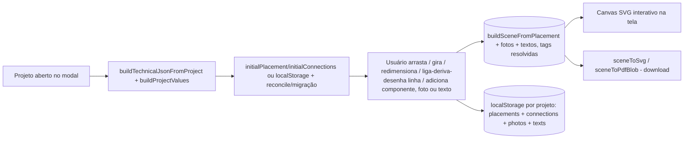

# Módulo: Diagramas

**Estado: 🟡 Alpha interno** — visível só para o **master**, operando sobre os
projetos do próprio tenant do master (GD Manager). Não disponível para os
demais tenants ainda.

## Duas interpretações (contexto histórico)
Este item da estrutura padrão tinha duas leituras possíveis:
1. Diagramas de arquitetura/fluxo (documentação) — já cobertos por Mermaid nos
   `.md` deste repositório.
2. **Diagrama unifilar elétrico do projeto** (feature de produto) — é este que
   está descrito abaixo.

## Objetivo
Gerar o **diagrama unifilar** (esquema elétrico simplificado: geração →
conversão → proteção → medição → rede) a partir dos dados já cadastrados do
projeto, como uma cartilha adicional exportável em SVG/PDF.

## Arquitetura
Existe uma proposta completa (motor de layout automático, roteamento
ortogonal, biblioteca de símbolos versionada, exportador DXF, editor visual
drag-and-drop) em `DIAGRAMA UNIFILAR/cad-engine-arquitetura.md`, fora do
repositório do app. O que está implementado hoje incrementa uma **fatia
vertical** dessa proposta com edição manual interativa — o
`ManualLayoutSource` do §17.2, construído **antes** do motor de layout
automático (inversão deliberada da ordem do roadmap original, decidida com o
usuário: útil mais cedo, e o motor automático continua no roadmap):

| Peça da proposta | Nesta fatia |
|---|---|
| Pacote isolado `packages/cad-engine/` (monorepo) | Módulo comum em `src/utils/cadEngine/` — este repo não é monorepo |
| Motor de layout automático (grafo, ranking, roteador ortogonal) | Ainda não construído. Existe um **layout fixo inicial** (fileira única) como ponto de partida, editável manualmente por cima. |
| `ManualLayoutSource` (§17.2) — layout desenhado pelo usuário | **Implementado**: arrastar (clique em qualquer ponto da figura, não só no traço — ver nota abaixo), girar em passos de 90°, **redimensionar** (arrastar o quadrado azul do canto), ligar/desenhar linhas com derivações e pontas soltas, selecionar e arrastar uma linha inteira como bloco. Condutores sem pontos de dobra usam roteamento **ortogonal simplificado** (`orthogonalPath`); com pontos de dobra (`waypoints`), a linha segue exatamente o caminho desenhado (`computeConnectorPoints`) — ver "Ligar / desenhar linha" abaixo. |
| Biblioteca de símbolos declarativa versionada | 6 símbolos fixos (`symbols.ts`), aproximados de IEC 60617: arranjo FV, inversor, disjuntor, medidor, rede e **DPS** (dispositivo de proteção contra surtos). Os 5 primeiros ficam no eixo horizontal (`y = H/2`), alinhados ao fluxo esquerda→direita; o DPS é vertical (componente de derivação para o terra, não em série). |
| Componentes fora da cadeia fixa do projeto | **Implementado, mas só visual**: qualquer um dos 6 tipos pode ser adicionado livremente ao diagrama (paleta "Adicionar"), sem precisar existir no cadastro do projeto — útil para representar um 2º inversor, um DPS, um disjuntor extra etc. Não altera `project_equipment` nem qualquer dado do projeto. |
| Fotos no diagrama | **Implementado**: upload de uma imagem (comprimida no cliente), vira um bloco arrastável/redimensionável no canvas, sai impressa no SVG/PDF exportado. Não faz parte da `Scene` "elétrica" — é uma camada `PHOTO` à parte. |
| Texto/legenda livre no diagrama | **Implementado**: bloco de texto solto (`PlacedText`), arrastável, editável por duplo-clique. Tanto ele quanto a legenda de qualquer componente aceitam tags `{chave}` do **mesmo catálogo dos templates .docx** (`TEMPLATE_VARIABLES`/`buildProjectValues` em `projectValues.ts`) — resolvidas ao vivo no canvas e no export, não gravadas como valor fixo. |
| Exportadores SVG / PDF / DXF / PNG via IR neutra | **SVG e PDF**, ambos consumindo a mesma `Scene` (IR já segue o princípio D1: um exportador novo não toca em layout/símbolos). `Primitive` ganhou a variante `image` para as fotos; `BlockInstance` ganhou `scale` (símbolos redimensionáveis). |
| JSON Técnico completo (grafo elétrico genérico) | `TechnicalJsonMvp`: cadeia fixa PV → Inversor → Disjuntor → Medidor → Rede, montada a partir de `project_equipment`/`project_general_data` do próprio projeto. Componentes adicionados manualmente (acima) não entram nesse JSON — só existem no layout salvo. |
| `DiagramTemplate` — salvar/aplicar layout como template (§17.3) | Não implementado ainda — ver roadmap |

## Arquivos
- `src/utils/cadEngine/types.ts` — `TechnicalJsonMvp` + Scene IR (subconjunto de D1; `BlockInstance.rotation`; `Primitive` inclui `image`; `LayerId` inclui `PHOTO`).
- `src/utils/cadEngine/symbols.ts` — definições geométricas dos 6 símbolos + `KIND_LABEL` (nome curto por tipo, usado na paleta "Adicionar").
- `src/utils/cadEngine/paper.ts` — constantes de papel/margem + moldura/carimbo (compartilhado entre o layout fixo e o editável).
- `src/utils/cadEngine/buildTechnicalJson.ts` — projeto → JSON técnico (reaproveita `buildProjectValues`).
- `src/utils/cadEngine/layout.ts` — JSON técnico → `Scene` com layout fixo (posição inicial, antes de qualquer edição).
- `src/utils/cadEngine/editableLayout.ts` — `PlacedSymbol` (com `scale`), `ManualConnection` (`from`/`to` são `ConnectionEndpoint` — `{kind:'symbol',id}` ou `{kind:'point',at}` —, mais `waypoints?: Point[]`), `PlacedPhoto`, `PlacedText`, `orthogonalPath`, `computeConnectorPoints` (aceita qualquer combinação de pontas symbol/point), `isConnectionResolvable`, `blockCenter` (considera a escala), `snapToGrid`, `buildSceneFromPlacement` (a `Scene` a partir do estado editado + fotos + textos, resolvendo tags via `tagValues`).
- `src/utils/cadEngine/exportSvg.ts` / `exportPdf.ts` — `Scene` → SVG / PDF, com suporte a `rotation`/`scale` do bloco (PDF transforma os pontos manualmente — escala em torno do centro, depois gira, mesma ordem em ambos; SVG usa `transform="...rotate()...scale()..."` nativo via `blockTransform()`, reaproveitado ao vivo pelo canvas) e à primitiva `image` (SVG: `<image href>`; PDF: `doc.addImage`, formato detectado pelo prefixo do data URL). PDF via `jspdf`, já usado em `resumoPdf.ts` — nenhuma dependência nova.
- `src/utils/projectValues.ts` — `resolveProjectTags(texto, values)`: substitui `{chave}` usando o mesmo catálogo `TEMPLATE_VARIABLES`/`buildProjectValues` dos templates .docx; tag desconhecida fica como está.
- `src/components/projects/UnifilarTab.tsx` — canvas SVG interativo (arrastar/girar/redimensionar/ligar-e-desenhar-com-derivação/selecionar-e-arrastar-linha-inteira/adicionar componente, foto ou texto) + botões de download.

## Permissões
Aba "Unifilar" no `ProjectModal`, gateada por `user?.isMaster` no front. Como o
master, no app normal, só vê o próprio tenant (ADR 0005 — sem bypass de RLS), e
o tenant do master é a GD Manager, o gate por `isMaster` já restringe
naturalmente a escala inicial pedida ("apenas master, empresa GD Manager") sem
precisar de RLS/RPC nova — os dados consumidos (`project_equipment`,
`project_general_data`) já são os do próprio projeto aberto no modal.

## Componentes e fotos adicionados manualmente
Além dos 5 componentes que vêm do cadastro do projeto (`TechnicalJsonMvp`), a
paleta "Adicionar" na barra de ferramentas cria uma instância solta de
qualquer um dos 6 tipos (`addComponent()` em `UnifilarTab.tsx`) — o id sempre
começa com `manual-` (ex.: `manual-dps-1721...`). "Adicionar foto" abre um
seletor de arquivo; a imagem é redimensionada/comprimida no navegador (máx.
900px, JPEG ~78% de qualidade) antes de virar `PlacedPhoto` — sem isso, uma
foto de celular sem compressão estouraria a cota do `localStorage` rapidamente.
Ambos são **só visuais**: não criam nem alteram nenhum registro de
`project_equipment`. Só é possível remover (botão "Remover selecionado" /
ícone na foto) o que foi adicionado manualmente — os 5 componentes do
cadastro do projeto são sempre exibidos.

## Ligar / desenhar linha (com derivações e linhas soltas)
Um único modo cobre criação direta, desenho manual, derivação e linha livre.
A origem e o destino de uma ligação (`ConnectionEndpoint`) podem ser um
**componente** ou um **ponto fixo** — o segundo é o que viabiliza derivação e
linha solta, sem precisar de um segundo tipo de entidade:

- Clique num componente → origem/destino é aquele componente (`{kind:'symbol'}`).
- Clique em qualquer outro lugar do canvas — vazio **ou em cima de uma linha
  já existente** — → vira um ponto fixo (`{kind:'point', at}`) na coordenada
  exata do clique. Clicar em cima de uma linha existente, visualmente, cria
  uma **derivação** (ramal em Y/T) dali; não há uma referência formal "esta
  ligação deriva da outra" guardada — é só o mesmo ponto no espaço, coincidente
  o bastante para parecer (e funcionar como) uma derivação.
- Clique no componente de destino → fecha a ligação ali. Clique em "Terminar
  aqui" (aparece com a ligação em andamento) → fecha no último ponto clicado,
  como ponta solta — é como se cria uma **linha totalmente livre** (as duas
  pontas soltas) ou uma derivação que não encosta em nenhum componente.
- Esc cancela a ligação em andamento a qualquer momento.

Depois de criada, a linha inteira tem três formas de edição:
- **Selecionar**: clique em qualquer trecho do traço (fica destacada em azul).
- **Mover como bloco**: arraste um trecho selecionado ou não — desloca todos
  os pontos de dobra (e as pontas soltas, se houver) juntos, mantendo o
  formato. Se a linha ainda não tinha pontos de dobra, o primeiro arrasto
  "semeia" com o roteamento automático atual antes de mover.
- **Ponto a ponto**: duplo-clique no meio de um trecho cria um novo ponto de
  dobra ali; arrastar um ponto de dobra (ou uma ponta solta) move só ele;
  duplo-clique num ponto de dobra remove.
- **Excluir**: com a ligação selecionada, tecla Delete/Backspace, botão
  "Remover selecionado" na barra, ou o ícone de lixeira na lista "Ligações".

## Redimensionar componentes
Com um símbolo selecionado, um quadrado azul aparece no canto — arrastar
aumenta/diminui `PlacedSymbol.scale` (0,4×–3×, uniforme). A matemática é
"escala em torno do centro do bloco, depois gira em torno do mesmo centro,
depois posiciona na página" — mesma ordem no SVG (`transform`, nativo do
navegador) e no PDF (`scalePoint`/`rotatePoint` manuais, já que o jsPDF não
tem transform de forma nativo); os dois foram conferidos numericamente para
darem o mesmo resultado ponto a ponto antes do commit. O quadrado de
redimensionar fica na borda **não girada** do símbolo (simplificação: em
componentes girados 90°/270°, a alça visualmente não fica exatamente no
canto "de cima" da figura já girada, mas arrastar continua funcionando).

## Texto livre e legenda com tags do projeto
"Adicionar → Texto" cria um bloco de texto solto, arrastável, editável por
duplo-clique (`window.prompt`). "Editar texto" (com um componente
selecionado) edita o nome e a legenda daquele símbolo, incluindo os
adicionados manualmente. Os dois aceitam tags `{chave}` — o **mesmo catálogo**
usado nos templates .docx (`TEMPLATE_VARIABLES` em `projectValues.ts`):
`{nome_titular}`, `{potencia_total}`, `{concessionaria}`, `{disjuntor}` etc.
Com um texto ou componente selecionado, um seletor "+ tag do projeto…"
aparece na barra e insere a tag escolhida. As tags são resolvidas **ao vivo**
(no canvas e no export SVG/PDF) contra os dados atuais do projeto — não são
gravadas como valor fixo, então acompanham qualquer edição posterior do
cadastro. Tag desconhecida/com erro de digitação fica visível como está (não
quebra o texto).

## Persistência
O layout editado (posições, rotações, escalas, ligações — incluindo
derivações/linhas soltas —, componentes extras, fotos e textos) é salvo em
**`localStorage`**, por projeto (`unifilar-layout:{projectId}`) — **só neste
navegador**, não sincroniza entre dispositivos/usuários e não é um
`DiagramTemplate` reutilizável. Ao reabrir a aba, o estado salvo é
reconciliado com os componentes atuais do projeto (`reconcile()` em
`UnifilarTab.tsx`): os 5 componentes fixos (`PV-01`, `INV-01`, ...) são
resincronizados a cada troca de equipamento — um removido do cadastro some do
layout, um novo aparece na posição padrão. Componentes/fotos/textos com id
`manual-` sobrevivem sempre, independentemente do que mudou no cadastro do
projeto (essa distinção pelo prefixo do id é proposital: "ausente do cadastro
atual" não dá pra usar como critério, porque um componente real removido do
projeto cairia no mesmo caso e ficaria fantasma no diagrama para sempre — bug
pego e corrigido num teste headless antes do commit). Diagramas salvos **antes**
das ligações virarem `ConnectionEndpoint` (formato antigo: `from`/`to` como
string direta) são migrados na leitura (`migrateConnection()`), sem quebrar
o que já estava salvo no navegador do usuário.

## Nota técnica — arrastar símbolos com `fill="none"`
Os primitivos dos símbolos são desenhados com `fill="none"` (só contorno). Em
SVG, uma forma sem preenchimento só recebe eventos de mouse **exatamente em
cima do traço**, não no interior da figura — clicar no meio de um símbolo
"vazio" não disparava o `mousedown` de arrastar. Corrigido com um `<rect>`
invisível (`fill="transparent"`, do tamanho da caixa 24×20mm) como primeiro
filho do `<g>` arrastável de cada símbolo: preenchimento transparente ainda
é "pintado" para fins de hit-test do navegador, então captura clique em
qualquer ponto da caixa e propaga para o handler do grupo.

## Fluxo

## Limitações desta fatia (deliberadas)
- A cadeia **oficial** do projeto continua fixa (PV→Inversor→Disjuntor→Medidor→Rede,
  vinda do cadastro) — sem BESS, sem múltiplos inversores/QDCs reais, sem
  geração compartilhada. Componentes extras adicionados manualmente (2º
  inversor, DPS etc.) só existem no desenho, não no `project_equipment`.
- Sem motor de layout automático/roteador com detecção de cruzamento — sem
  pontos de dobra manuais, o roteamento é um Manhattan de 2 segmentos simples;
  com pontos de dobra (arrastando ou desenhando na criação), o usuário
  controla o caminho à mão, sem ajuda automática (sem ortogonalização, sem
  desvio de outros traços/símbolos).
- Símbolos aproximados; **pendente calibrar** com unifilares reais aprovados da
  GD Manager (combinado com o usuário — ele vai enviar exemplos).
- Fotos não giram (só arrastar/redimensionar) — suficiente para o uso previsto
  (foto do local, fachada, padrão de entrada).
- Derivação não é uma referência formal ("esta linha nasce daquela outra") —
  é só um ponto fixo coincidente. Se a linha original for movida depois, a
  derivação não a acompanha automaticamente (fica visualmente desencostada).
- Alça de redimensionar dos símbolos não acompanha a rotação (fica sempre no
  canto "não girado"); o redimensionamento em si funciona normalmente.
- Sem exportador DXF, sem `DiagramTemplate` (salvar/aplicar layout em outro
  projeto).
- Layout persiste só em `localStorage` deste navegador — não sincroniza entre
  quem usa o sistema, e some se o navegador for trocado ou o storage limpo.
  Fotos sem compressão agressiva poderiam estourar a cota (~5-10MB) rápido;
  por isso o upload já redimensiona/comprime antes de salvar.
- Só o master vê; outros tenants não têm acesso ainda.

## Melhorias futuras
Combinado com o usuário: a próxima etapa é uma **tela dedicada ao motor de
templates de diagrama** (fora desta fatia, ainda não iniciada) — lá sim entra
o `DiagramTemplate` (§17.3 da proposta): montar/salvar modelos reutilizáveis
de unifilar, e o modal do projeto passa a **importar** o diagrama pronto
conforme a especificação do projeto, em vez de montar tudo do zero como hoje.
Até lá, esta fatia (dentro do modal do projeto) continua recebendo incrementos
diretos. Ver a proposta completa em `DIAGRAMA UNIFILAR/cad-engine-arquitetura.md`
para o plano em etapas (motor de layout automático, roteamento, DXF, editor
visual, regras por concessionária, liberação para outros tenants). Ver também
[ADR 0006](../../adr/0006-cad-engine-alpha.md).
