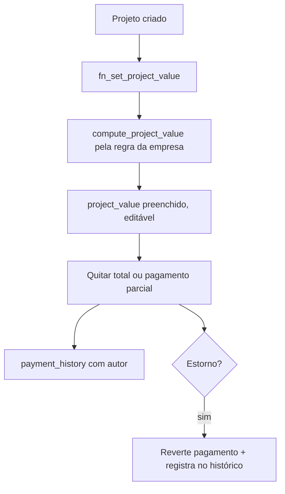
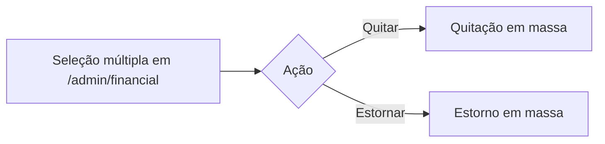

# Financeiro — Fluxos

## Cálculo e quitação

```mermaid
flowchart TD
  New[Projeto criado] --> Trig[fn_set_project_value]
  Trig --> Calc[compute_project_value pela regra da empresa]
  Calc --> Val[project_value preenchido, editável]
  Val --> Pay[Quitar total ou pagamento parcial]
  Pay --> Hist[payment_history com autor]
  Pay --> Rev{Estorno?}
  Rev -->|sim| Reverse[Reverte pagamento + registra no histórico]
```

## Lote

```mermaid
flowchart LR
  Sel[Seleção múltipla em /admin/financial] --> Act{Ação}
  Act -->|Quitar| Q[Quitação em massa]
  Act -->|Estornar| E[Estorno em massa]
```
