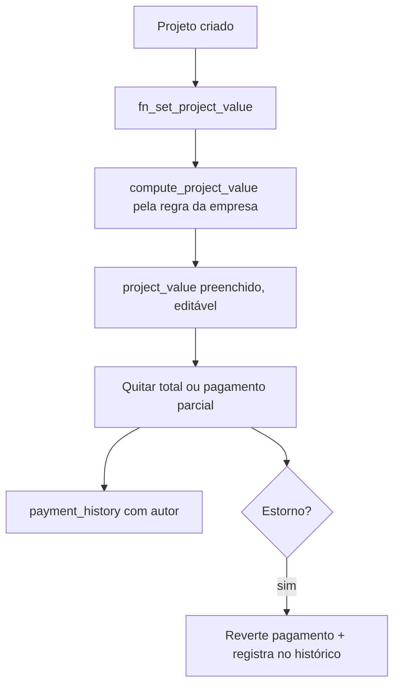
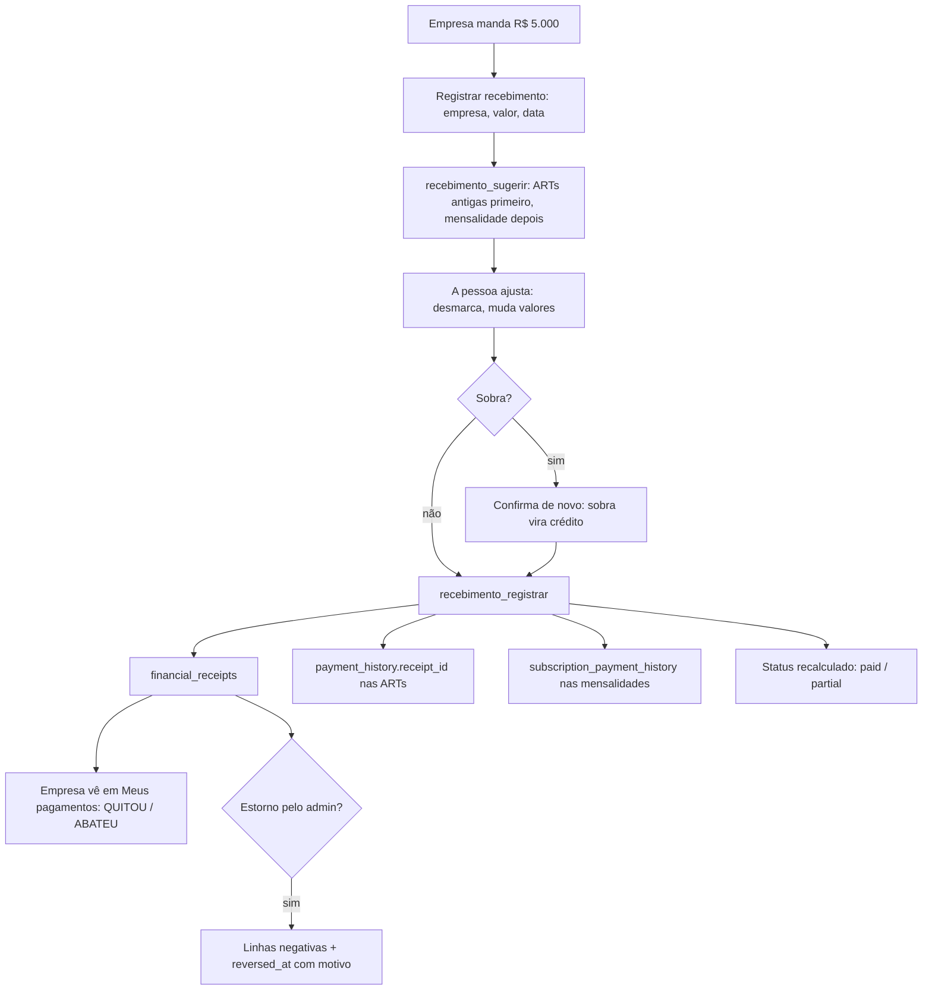

# Financeiro — Fluxos

## Cálculo e quitação

```mermaid
flowchart TD
  New[Projeto criado] --> Trig[fn_set_project_value]
  Trig --> Calc[compute_project_value pela regra da empresa]
  Calc --> Val[project_value preenchido, editável]
  Val --> Pay[Quitar total ou pagamento parcial]
  Pay --> Hist[payment_history com autor]
  Pay --> Rev{Estorno?}
  Rev -->|sim| Reverse[Reverte pagamento + registra no histórico]
```

## Lote

```mermaid
flowchart LR
  Sel[Seleção múltipla em /admin/financial] --> Act{Ação}
  Act -->|Quitar| Q[Quitação em massa]
  Act -->|Estornar| E[Estorno em massa]
```

## Recebimento em lote — o valor redondo

```mermaid
flowchart TD
  Dep[Empresa manda R$ 5.000] --> Dlg[Registrar recebimento: empresa, valor, data]
  Dlg --> Sug[recebimento_sugerir: ARTs antigas primeiro, mensalidade depois]
  Sug --> Aj[A pessoa ajusta: desmarca, muda valores]
  Aj --> Conf{Sobra?}
  Conf -->|sim| C2[Confirma de novo: sobra vira crédito]
  Conf -->|não| Reg
  C2 --> Reg[recebimento_registrar]
  Reg --> Rec[financial_receipts]
  Reg --> P1[payment_history.receipt_id nas ARTs]
  Reg --> P2[subscription_payment_history nas mensalidades]
  Reg --> St[Status recalculado: paid / partial]
  Rec --> Ver[Empresa vê em Meus pagamentos: QUITOU / ABATEU]
  Rec --> Est{Estorno pelo admin?}
  Est -->|sim| Neg[Linhas negativas + reversed_at com motivo]
```
