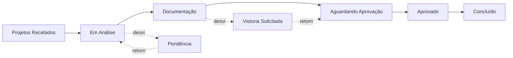
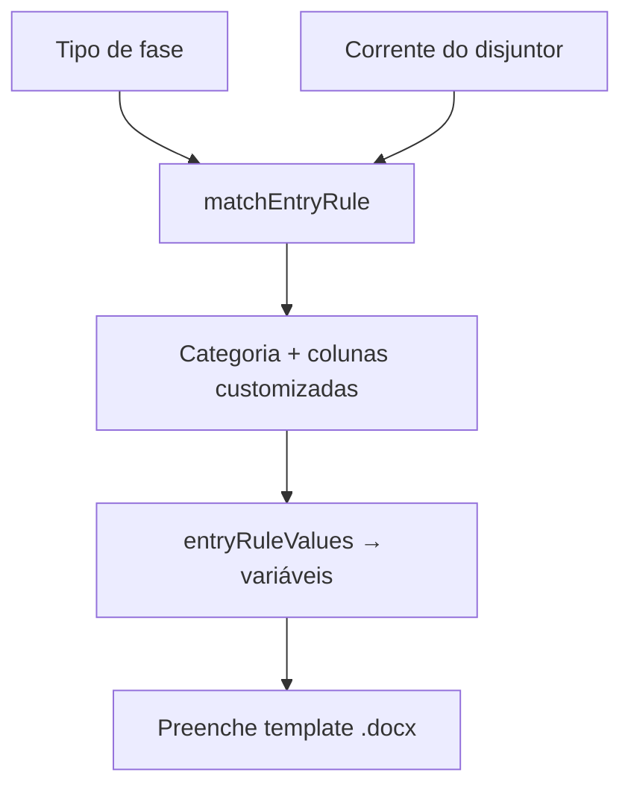

# Homologação — Fluxos

## Etapas do projeto

```mermaid
flowchart LR
  P[Projetos Recebidos] --> A[Em Análise]
  A --> D[Documentação]
  D --> AP[Aguardando Aprovação]
  AP --> OK[Aprovado]
  OK --> C[Concluído]
  A -.desvio.-> PE[Pendência]
  D -.desvio.-> V[Vistoria Solicitada]
  PE -.retorno.-> A
  V -.retorno.-> AP
```

## Padrão de entrada → template

```mermaid
flowchart TD
  Fase[Tipo de fase] --> Match[matchEntryRule]
  Disj[Corrente do disjuntor] --> Match
  Match --> Cat[Categoria + colunas customizadas]
  Cat --> Vars[entryRuleValues → variáveis]
  Vars --> Doc[Preenche template .docx]
```
