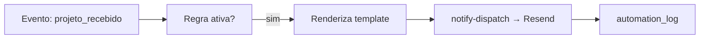

# Módulo: Notificações e Automações

## Objetivo
Enviar comunicações automáticas (e-mail) e notificações internas em resposta a
eventos do sistema (ex.: "projeto recebido"), configuráveis por regra.

## Funcionalidades
- **Motor de automações** (`notification_rules`) — regra por evento + template,
  com flag Pro. Tela `/admin/automations`.
- Envio de e-mail via **Resend** (`notify-dispatch`), renderizando template com
  variáveis do projeto.
- **Notificações internas** (`notifications`) — avisos no app.
- Disparo no evento de criação: `dispatchNotification('projeto_recebido', ...)`.
- Log de automações (`automation_log`).

## Banco
`notification_rules` (12 col.), `notifications` (9 col.), `automation_log`.

## Hooks / componentes
`useNotificationRules`, `useNotifications`, `useStaleNotifications`,
`src/lib/notify.ts` (`dispatchNotification`), `src/pages/admin/Automations.tsx`.

## Regras
- **RN-NOT-01** — Automações de e-mail dependem do **Resend configurado**
  (`RESEND_API_KEY`, domínio verificado, `NOTIFY_FROM`) — **pendência** atual.
- **RN-NOT-02** — Isolamento por tenant; templates usam `buildProjectValues`.
- **RN-NOT-03** — Alguns recursos são gated por plano Pro.

## Fluxo

## Futuro
- **WhatsApp** via Evolution API por tenant (planejado). Ver roadmap.
