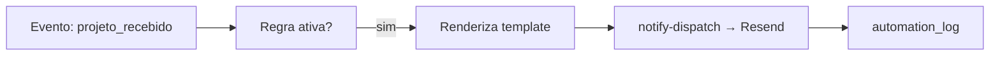

# Módulo: Notificações e Automações

## Objetivo
Enviar comunicações automáticas (e-mail) e notificações internas em resposta a
eventos do sistema (ex.: "projeto recebido"), configuráveis por regra.

## Funcionalidades
- **Motor de automações** (`notification_rules`) — regra por evento + template,
  com flag Pro. Tela `/admin/automations`.
- Envio de e-mail via **Resend** (`notify-dispatch`), renderizando template com
  variáveis do projeto.
- **Notificações internas** (`notifications`) — avisos no app.
- Disparo no evento de criação: `dispatchNotification('projeto_recebido', ...)`.
- Log de automações (`automation_log`).

## Banco
`notification_rules` (12 col.), `notifications` (9 col.), `automation_log`,
`task_automations` + `tasks.automation_id`.

## Hooks / componentes
`useNotificationRules`, `useNotifications`, `useStaleNotifications`,
`src/lib/notify.ts` (`dispatchNotification`), `src/pages/admin/Automations.tsx`,
`useTaskAutomations`.

## Regras
- **RN-NOT-01** — Automações de e-mail dependem do **Resend configurado**
  (`RESEND_API_KEY`, domínio verificado, `NOTIFY_FROM`) — **pendência** atual.
- **RN-NOT-02** — Isolamento por tenant; templates usam `buildProjectValues`.
- **RN-NOT-03** — Alguns recursos são gated por plano Pro.

## Tarefas automáticas por etapa do Kanban

Regra do tenant: *"card entrou na etapa X (opcionalmente vindo da etapa Y) →
cria tarefa para fulano com N dias de prazo"*. Aba **Tarefas automáticas** em
`/admin/automations`.

- **RN-NOT-04** — O disparo é um **gatilho no banco** (`trg_task_automations`
  em `projects`, `AFTER UPDATE OF status`), não código de tela: a etapa muda
  pelo arrastar do quadro, pelo seletor do modal e pela aplicação de etapa
  vinda do `/email-updates`, e o gatilho pega os três.
- **RN-NOT-05** — As etapas da regra são o **`status_key` do template de
  Kanban ativo** (`kanban_columns`), nunca uma lista fixa; a tela lê as
  mesmas colunas via `useDefaultKanbanModel`. `from_status` nulo = qualquer
  etapa de origem.
- **RN-NOT-06** — **Não empilha**: se a tarefa anterior da mesma regra para o
  mesmo projeto ainda está aberta (`pending`/`in_progress`), o card entrando
  de novo na etapa não gera outra. A marca de origem é `tasks.automation_id`.
- **RN-NOT-07** — Só **admin e projetista** do mesmo tenant podem ser
  responsáveis; o gatilho reconfere isso a cada disparo e ignora a regra
  órfã (usuário removido ou movido de tenant).
- **RN-NOT-08** — Quem configura é o **admin**; o projetista apenas lê.
  `due_date` = data da mudança + `days_to_complete`. O responsável recebe
  notificação no sino, como em qualquer tarefa atribuída.
- Variáveis no título/descrição: `{codigo}` `{titular}` `{empresa}` `{etapa}`
  `{etapa_anterior}` `{dias}`.

## Fluxo

## Futuro
- **WhatsApp** via Evolution API por tenant (planejado). Ver roadmap.
