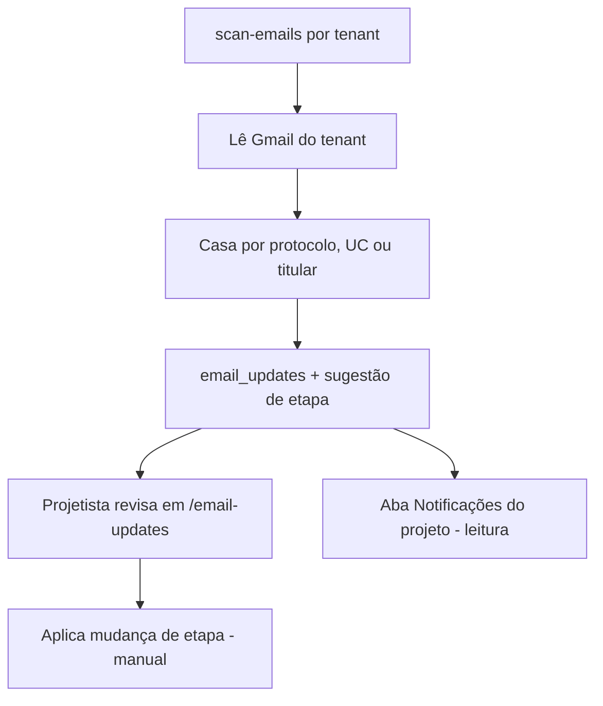

# Módulo: OCR / Análise por IA (Claudinho)

> No sistema, a análise de documentos e e-mails é feita pelo assistente
> **Claudinho**. Não há um OCR clássico isolado; a leitura/extração é feita por
> IA nas edge functions.

## Objetivo
1. **Análise de documentos** enviados no formulário (ex.: conta de energia,
   documento do titular) para pré-preencher campos do projeto.
2. **Leitura de e-mails** das concessionárias (Gmail), casando ao projeto pelo
   **protocolo**, pela **unidade consumidora** ou pelo **nome do titular**, e
   **sugerindo** a próxima etapa.

## Componentes
- Edge `claudinho-verifica` — análise/verificação (sugere etapa/protocolo).
- Edge `scan-emails` — varre o Gmail por tenant (`scanTenant()`), casa e-mails a
  projetos (`match_emails_to_protocols(_tenant_id)`) e diz à IA por qual dado o
  e-mail chegou (`matchContext()`).
- Edge `test-gmail` — testa credenciais.
- Tabelas: `agent_config` (credenciais por tenant), `email_updates`,
  `email_attachments`, `email_scan_runs`.
- RPC `project_emails(_project_id)` — os e-mails **deste** projeto: os já
  vinculados e os que ainda só *citam* o projeto (`apenas_sugerido`).
- Helpers SQL `txt_norm(texto)` (minúsculas sem acento) e
  `holder_name_regex(nome)` (âncora primeiro+último nome).
- Front: `src/pages/EmailUpdates.tsx`, `useEmailUpdates`, `useAgentConfig`,
  `src/components/projects/ProjectEmailsTab.tsx` (aba **Notificações** do modal
  do projeto — somente leitura, com atalho para a tela de E-mails).

## Regras de negócio
- **RN-OCR-01** — O Claudinho **não altera o projeto sozinho**: ele sugere; o
  usuário revisa e aplica. (Automação é passo futuro.)
- **RN-OCR-02** — Casamento e-mail↔projeto tem **três chaves**, sempre com
  filtro de `tenant_id` (a função cruzava sem filtro — corrigido). Quando mais
  de uma bate, vence a de maior prioridade, e `email_updates.match_type` guarda
  qual foi (`protocol` · `uc` · `holder`):
  1. **protocolo** (`projects.protocol_number`) — o mais forte; exige ≥4
     caracteres e ignora o texto "sem protocolo";
  2. **unidade consumidora** (`project_general_data.uc_number`) — exige ≥5
     dígitos e casa o número **inteiro** (âncoras `\m…\M`), então uma UC nunca
     casa como pedaço de um número maior;
  3. **nome do titular** (`project_general_data.holder_name`) — exige
     **primeiro + último** nome na mesma vizinhança (janela de 24 caracteres,
     `holder_name_regex`), aceitando meio abreviado ("NIKSON A. SILVA"). Só o
     primeiro nome, só o sobrenome ou nome único **não** casam.
  Só o casamento por protocolo preenche `protocol_number`/`protocol_matched`.
- **RN-OCR-03** — Credenciais Gmail ficam por tenant em `agent_config`; a view
  `agent_config_safe` usa `security_invoker=true` (não vaza credenciais).
- **RN-OCR-04** — Consumo de IA é limitado por plano (`ai_usage_log`,
  `consume_ai_quota`). Desde jul/2026, `consume_ai_quota` devolve `log_id` e
  cada edge function de IA completa o lançamento com o modelo e os tokens
  reais da resposta (`update_ai_usage_tokens`, best-effort) — é a base do
  extrato "Agentes de IA" no console master (ver
  [modules/reports](../reports/overview.md) / console `/painel`).
- **RN-OCR-05** — Nome do titular no documento de identidade: em **RG/CNH** o
  titular é o campo **"NOME"** (o portador), **nunca a FILIAÇÃO** (pai/mãe); em
  **Cartão CNPJ** é a **razão social**. O prompt (`claudinho-verifica`,
  `buildAnalyzePrompt`/`buildComparePrompt`) instrui isso explicitamente. Bug
  histórico: em CNH, pegava o nome da filiação (corrigido, jul/2026).
- **RN-OCR-07** — **A UC nunca é o CPF/CNPJ.** Além da regra no prompt, a
  função aplica uma guarda **determinística** (`limparUcQueEhDocumento`): se o
  `uc_number` extraído tiver os mesmos dígitos do `cpf_cnpj`, ou vier com
  máscara de documento (`000.000.000-00` / `00.000.000/0000-00`), o campo é
  devolvido **vazio**. Vazio é melhor que errado — UC errada faz a
  concessionária recusar o pedido, e o campo em branco é visível pra quem
  confere. Caso real: PRJ-66913 (ago/2026), em que o modelo leu o CPF impresso
  na conta e devolveu o mesmo valor nos dois campos, com 92% e 91% de
  confiança. Prompt é probabilístico; a guarda não depende de o modelo
  obedecer.
- **RN-OCR-06** — A aba **Notificações** do projeto (`project_emails`) mostra
  também e-mails **ainda não vinculados** que citam o projeto
  (`apenas_sugerido = true`) — o vínculo em si continua sendo feito pela
  varredura. A aba é **somente leitura**: aplicar/descartar a sugestão de etapa
  continua num lugar só, a tela `/email-updates`. A RPC é `SECURITY DEFINER` e
  recusa quem não é do tenant do projeto (nem master).

## Deploy
`claudinho-verifica` **entrou no CI** (ago/2026) junto de scan-emails,
test-gmail e log-event — publicar à mão já causou uma publicação com conteúdo
errado. `--no-verify-jwt` porque a função faz a própria checagem de
Authorization. Segredo: `ANTHROPIC_API_KEY`. Modelo: `claude-haiku-4-5`.

## Fluxo

## Limitações / futuro
- Aplicação automática de etapa (hoje é manual). Ver
  [../../project/roadmap.md](../../project/roadmap.md).
- Setup do Gmail: `docs/GMAIL_SETUP.md`.
