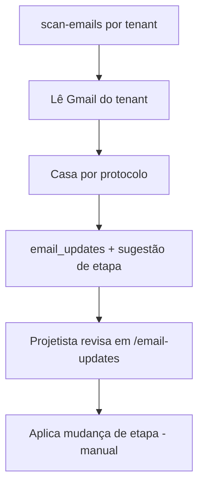

# Módulo: OCR / Análise por IA (Claudinho)

> No sistema, a análise de documentos e e-mails é feita pelo assistente
> **Claudinho**. Não há um OCR clássico isolado; a leitura/extração é feita por
> IA nas edge functions.

## Objetivo
1. **Análise de documentos** enviados no formulário (ex.: conta de energia,
   documento do titular) para pré-preencher campos do projeto.
2. **Leitura de e-mails** das concessionárias (Gmail), casando ao projeto pelo
   **protocolo** e **sugerindo** a próxima etapa.

## Componentes
- Edge `claudinho-verifica` — análise/verificação (sugere etapa/protocolo).
- Edge `scan-emails` — varre o Gmail por tenant (`scanTenant()`), casa e-mails a
  protocolos (`match_emails_to_protocols(_tenant_id)`).
- Edge `test-gmail` — testa credenciais.
- Tabelas: `agent_config` (credenciais por tenant), `email_updates`,
  `email_attachments`, `email_scan_runs`.
- Front: `src/pages/EmailUpdates.tsx`, `useEmailUpdates`, `useAgentConfig`.

## Regras de negócio
- **RN-OCR-01** — O Claudinho **não altera o projeto sozinho**: ele sugere; o
  usuário revisa e aplica. (Automação é passo futuro.)
- **RN-OCR-02** — Casamento e-mail↔projeto é por **protocolo**, com filtro de
  `tenant_id` (a função cruzava sem filtro — corrigido).
- **RN-OCR-03** — Credenciais Gmail ficam por tenant em `agent_config`; a view
  `agent_config_safe` usa `security_invoker=true` (não vaza credenciais).
- **RN-OCR-04** — Consumo de IA é limitado por plano (`ai_usage_log`,
  `consume_ai_quota`). Desde jul/2026, `consume_ai_quota` devolve `log_id` e
  cada edge function de IA completa o lançamento com o modelo e os tokens
  reais da resposta (`update_ai_usage_tokens`, best-effort) — é a base do
  extrato "Agentes de IA" no console master (ver
  [modules/reports](../reports/overview.md) / console `/painel`).
- **RN-OCR-05** — Nome do titular no documento de identidade: em **RG/CNH** o
  titular é o campo **"NOME"** (o portador), **nunca a FILIAÇÃO** (pai/mãe); em
  **Cartão CNPJ** é a **razão social**. O prompt (`claudinho-verifica`,
  `buildAnalyzePrompt`/`buildComparePrompt`) instrui isso explicitamente. Bug
  histórico: em CNH, pegava o nome da filiação (corrigido, jul/2026).

## Deploy
`claudinho-verifica` **não está no CI** (só scan-emails, test-gmail, log-event).
É publicada via MCP `deploy_edge_function` (mantendo `verify_jwt: false`, pois a
função faz a própria checagem de Authorization). Segredo: `ANTHROPIC_API_KEY`.
Modelo: `claude-haiku-4-5`.

## Fluxo

## Limitações / futuro
- Aplicação automática de etapa (hoje é manual). Ver
  [../../project/roadmap.md](../../project/roadmap.md).
- Setup do Gmail: `docs/GMAIL_SETUP.md`.
