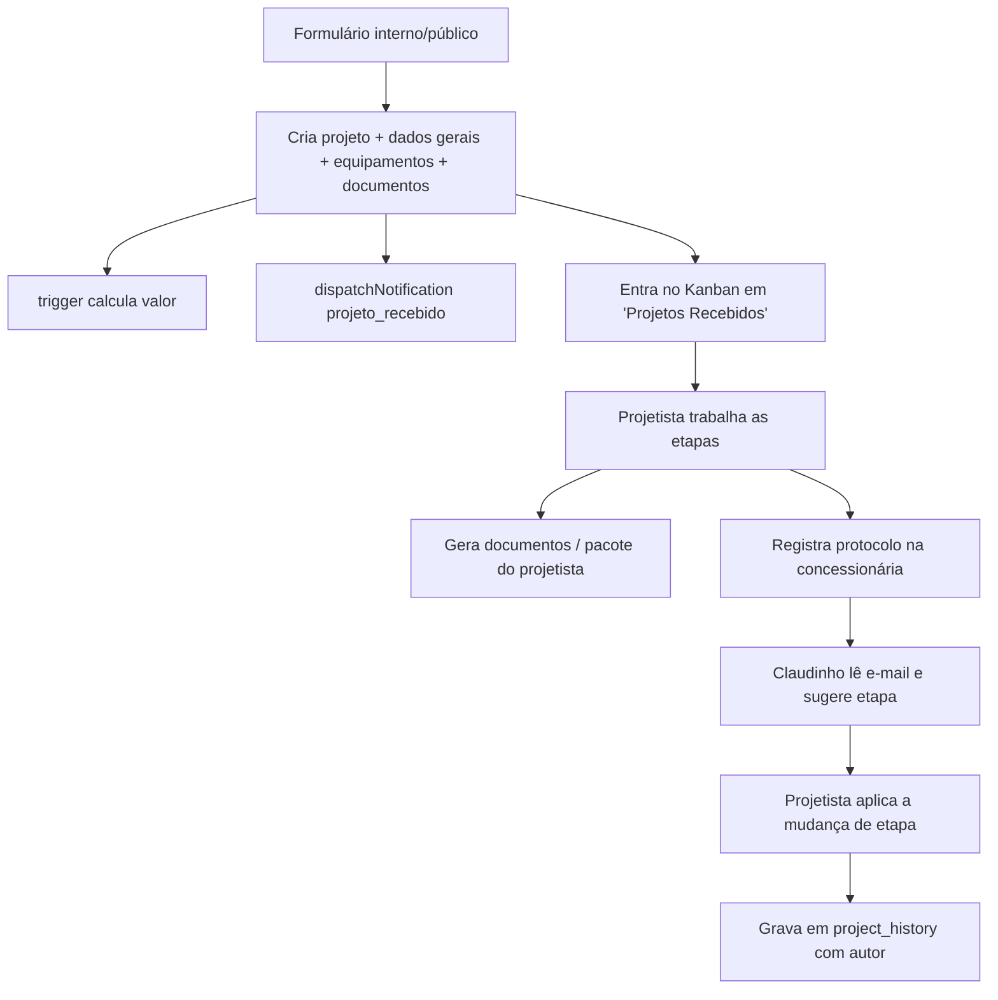
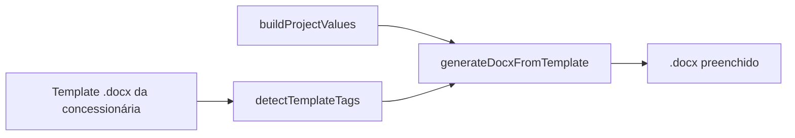

# Projetos — Fluxos

## Ciclo de vida

```mermaid
flowchart TD
  Form[Formulário interno/público] --> Create[Cria projeto + dados gerais + equipamentos + documentos]
  Create --> Value[trigger calcula valor]
  Create --> Notify[dispatchNotification projeto_recebido]
  Create --> Kanban[Entra no Kanban em 'Projetos Recebidos']
  Kanban --> Work[Projetista trabalha as etapas]
  Work --> Docs[Gera documentos / pacote do projetista]
  Work --> Protocol[Registra protocolo na concessionária]
  Protocol --> Claud[Claudinho lê e-mail e sugere etapa]
  Claud --> Decide[Projetista aplica a mudança de etapa]
  Decide --> Hist[Grava em project_history com autor]
```

## Geração de documento

```mermaid
flowchart LR
  T[Template .docx da concessionária] --> D[detectTemplateTags]
  P[buildProjectValues] --> G[generateDocxFromTemplate]
  D --> G
  G --> Out[.docx preenchido]
```
