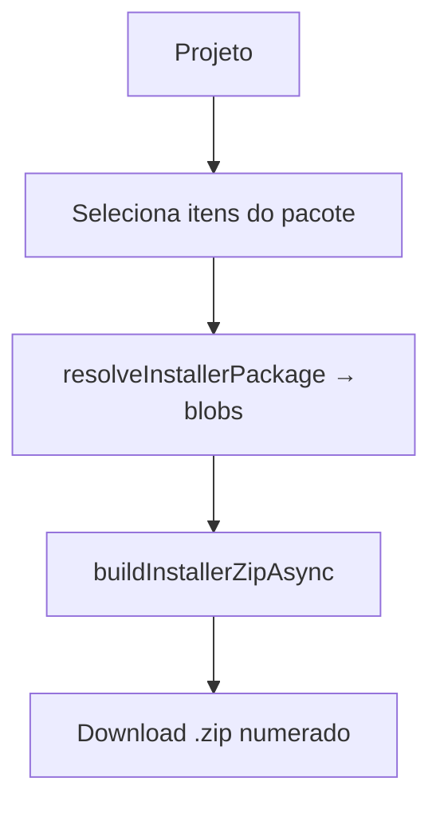

# Módulo: Relatórios

## Objetivo
Gerar documentos e visões consolidadas: cartilha RESUMO do projeto, pacote do
projetista, relatórios financeiros e de produção.

## Funcionalidades
- **Cartilha RESUMO (PDF)** — `src/utils/resumoPdf.ts`. Titular/UC, endereço,
  equipamentos, localização, protocolo. **Estampa o logo do tenant** no cabeçalho.
- **Pacote do Projetista/Instalador (ZIP)** — `src/utils/installerPackage.ts`:
  resumo + documentos do projeto + INMETRO/datasheet/AFCI + templates
  preenchidos. Reaproveita fotos de projetos com mesmo disjuntor+fase.
- **Documentos de template (.docx)** — por concessionária.
- **Relatórios** (`/reports`) — filtros, séries, exportação.

## Banco / storage
Lê `projects`, `project_*`, `documents`, `equipment_catalog`,
`concessionaire_templates`. Buckets `project-documents`, `equipment-documents`,
`concessionaire-templates`.

## Hooks
`useReports`, `useReportFilters`, `useFinancialReport`, `useInstallerPackage`,
`useDocumentPreview`.

## Regras
- **RN-REP-01** — Relatórios usam o **logo do tenant** (não da empresa).
- **RN-REP-02** — jsPDF não desenha **SVG**; usar PNG/JPG no logo.
- **RN-REP-03** — Pacote: INMETRO do inversor cai para busca por marca+modelo se
  o vínculo do catálogo não tiver o documento (robustez).
- **RN-REP-04** — Anexos extras do formulário ficam disponíveis para incluir no
  pacote.
- **RN-REP-05** — Pacote: um item com status `error` (documento existe mas
  falhou ao baixar/converter) é **diferente** de `missing` (nunca enviado) —
  mostra a mensagem real e um botão "Tentar novamente" (`retryInstallerPackageItem`),
  em vez do mesmo "Faltando (obrigatório)" das duas situações. Antes disso, uma
  falha transitória de rede/conversão era indistinguível de "o cliente nunca
  mandou o documento", o que dificultava investigar (caso real: PRJ-34220, os
  documentos existiam no banco/storage mas o dialog mostrava "Faltando").

## Fluxo

