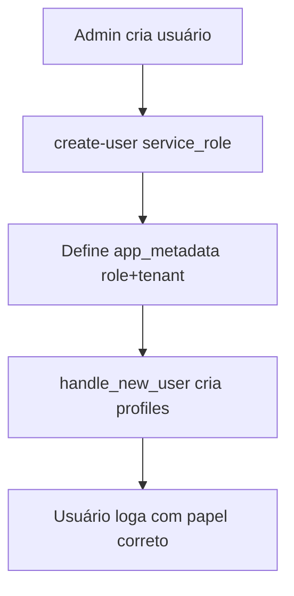

# Módulo: Usuários

## Objetivo
Gerenciar os usuários do tenant (admin, staff, company), sua criação,
permissões básicas e o modo de acesso do projetista.

## Funcionalidades
- CRUD de usuários (`/admin/users`) via edge functions com `service_role`.
- Papéis: `admin`, `staff`, `company` (ver [permissions](../permissions/overview.md)).
- `staff_access_mode`: `global` ou `assigned_only`.
- Perfil do usuário (`/profile`): dados, senha, avatar; admin envia logo do
  tenant; empresa envia o logo da própria empresa.
- Onboarding / Product Tour por tipo de usuário.

## Banco
`profiles` (16 col.), `user_roles`, `project_assignments`.

## Edge Functions
- `create-user` — cria com `app_metadata` (role/tenant).
- `update-user` — atualiza; **checa tenant do alvo**.
- `delete-user` — exclui; checa tenant do alvo.

## Hooks / componentes
`useUsers`, `useStaffSettings`, `src/pages/admin/Users.tsx`,
`src/pages/Profile.tsx`, `src/components/onboarding/*`.

## Regras
- **RN-USR-01** — Cada tenant cria seus próprios usuários sem interferir em
  outros tenants (edge functions validam tenant do alvo).
- **RN-USR-02** — Papel/tenant sempre em `app_metadata` (ADR 0003).
- **RN-USR-03** — Limite de usuários por plano (`fn_enforce_user_limit`).
- **RN-USR-04** — `is_master` protegido por `fn_protect_master_flag`.

## Fluxo

