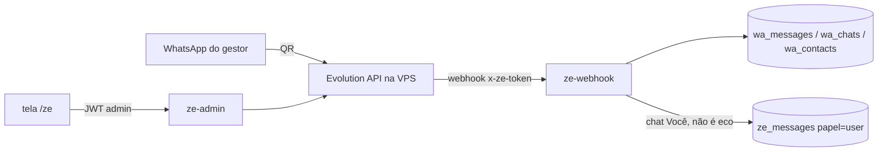

# Módulo: Zé (José) — assistente pessoal no WhatsApp

## Objetivo
Funcionário de IA que conversa com o gestor do GD Manager pelo próprio
WhatsApp (chat "Você"): resume o dia, aponta cards parados e dados faltando,
revisa conversas sem resposta, avisa mudanças de etapa e executa pedidos
simples (tarefas, notas, mover etapa com confirmação). Aprende com o gestor
e entende áudio. **Nunca envia mensagem a terceiros.**

Spec: [`docs/superpowers/specs/2026-09-17-ze-whatsapp-design.md`](../../superpowers/specs/2026-09-17-ze-whatsapp-design.md).
Plano da fundação: [`docs/superpowers/plans/2026-09-17-ze-fundacao.md`](../../superpowers/plans/2026-09-17-ze-fundacao.md).

**Estado: Entregas 1 e 2 NO AR (23/09/2026).** Evolution 2.3.7 em
`https://zap.homologamanager.com.br`, número conectado, espelho nos dois
sentidos, envio para o próprio número confirmado (o plano B do grupo,
previsto na spec §16, foi descartado) e o **cérebro respondendo**: escreveu
no chat "Você" → resposta em 10-15 s. Entregas 3–6 (escrita com confirmação,
aprendizado/áudio, rotinas/eventos, skill) pendentes.

## Regras duras (no código, não no prompt)
1. **Só envia ao próprio JID** (`ze_config.phone_jid`). A única ferramenta de
   envio recebe o número lido da config; não existe caminho para terceiros.
2. Nunca muda etapa sem **confirmação explícita** (pendência de 24 h) — Entrega 3.
3. `tenant_id` vem de `ze_config`, nunca do modelo.
4. Conversas de terceiros são **dados**, não instruções.
5. `wa_*` e `ze_messages`: **só o dono lê** (RLS `ze_dono_ok`). Retenção de
   30 dias para mensagens de terceiros (Entrega 5).
6. O que ele grava tem autor = gestor e `origin = 'ze'`.
7. **A lista oficial de tarefas (`tasks`) não recebe palpite de robô.** O que
   ele sugere por conta própria fica em `ze_tarefas_sugeridas` e só vira
   tarefa do sistema quando o gestor aceita (aba **Sugestões do Zé** em
   `/tasks`, bloco no `/ze`, ou "cria 1 e 3" pelo WhatsApp). Pedido direto do
   gestor no chat cria na hora. Em modo `rotina` as ferramentas que escrevem
   em `tasks` nem entram no array de tools — Entrega 3, spec §7.1.

## Infra
- **Evolution API v2** na VPS (`/opt/evolution`, Docker: api + postgres +
  redis; a API escuta só em `127.0.0.1:8080`). Nginx
  `zap.homologamanager.com.br` + certbot.
- Workflow manual [`evolution-vps.yml`](../../../.github/workflows/evolution-vps.yml)
  com `simular | instalar | atualizar | status`. O `.env` é **preservado**
  entre execuções — trocar a chave lá sem atualizar o secret da edge function
  quebraria tudo em silêncio.
- Instância `ze-<12 primeiros caracteres do tenant>`; webhook por instância
  apontando para `/functions/v1/ze-webhook` com header `x-ze-token`.
- Segredos: GitHub `EVOLUTION_API_KEY`, `EVOLUTION_DB_PASSWORD`,
  `CERTBOT_EMAIL` (opcional); edge functions `EVOLUTION_URL`,
  `EVOLUTION_API_KEY`, `ZE_WEBHOOK_TOKEN`.

## Banco (migração `20260922100000_ze_fundacao.sql`)
| Tabela | Para quê |
|---|---|
| `ze_config` | 1 linha por tenant: dono, instância, `phone_jid`, `situacao`, `qr_code` e preferências (modelo de IA, fuso, horas sem resposta, grupos, áudio). |
| `wa_chats` | Uma linha por conversa: nome, grupo, quando foi a última mensagem e de quem. |
| `wa_messages` | Espelho das mensagens (`UNIQUE tenant_id, wa_id`). Mídia entra como rótulo (`[imagem]`, `[documento x.pdf]`, `[áudio 12s]`). |
| `wa_contacts` | Quem é quem: papel, empresa, projetos, notas, `ignorar`. |
| `ze_messages` | O diálogo no chat "Você". O `wa_id` das mensagens que o Zé mandou é o que permite distinguir **eco** de **fala do gestor**. |

RPCs: `ze_admin_ok()` (admin de tenant `is_library`), `ze_dono_ok(tenant)`
(dono do WhatsApp), `ze_ativar()` (cria a config do tenant de quem chama).

## O cérebro (Entrega 2)

`ze-brain` recebe `{modo:'mensagem', tenant_id}`, monta o prompt com o
**panorama** (tarefas de hoje/atrasadas, projetos por etapa, e-mails e
recomendações pendentes, equipe) e roda um laço de **tool use** com 12
ferramentas de leitura, respondendo pelo WhatsApp.

- **Modelo**: `ze_config.modelo_ia` (padrão `claude-opus-5`), thinking
  adaptativo, `effort` da config, `max_tokens` 16000. Os blocos da resposta
  voltam **inteiros** (inclusive `thinking`) na próxima volta — exigência da
  API quando o raciocínio adaptativo está ligado. Resultados de ferramentas
  paralelas vão numa **única** mensagem de usuário.
- **Ferramentas**: tarefas · projetos · projetos_parados ·
  projetos_dados_faltando · buscar_projeto · detalhe_projeto ·
  conversas_sem_resposta · ler_conversa · mensagens_recebidas ·
  contexto_do_contato · emails_pendentes · recomendacoes_ludmilla.
  Todas recebem o `tenant_id` da config, nunca do modelo (regra dura 3), e
  devolvem **texto compacto** com corte em 15-25 linhas (`… e mais N`).
- **Leituras pesadas são SQL** (`ze_panorama`, `ze_conversas_sem_resposta`,
  `ze_projetos_parados`, `ze_projetos_dados_faltando`); as simples são
  `.from()` no TypeScript.
- **Trava** `ze_lock` (3 min) para não rodar dois cérebros ao mesmo tempo;
  cada execução vira uma linha em `ze_runs` (ferramentas, duração, tokens).
- **Resposta**: markdown vira o pouco que o WhatsApp entende (`paraWhatsapp`)
  e é partida em pedaços de 1500 caracteres (`partirMensagem`), cada um
  gravado em `ze_messages` com o `wa_id` — é isso que impede o webhook de
  tratar a fala do Zé como fala do gestor.
- **Assíncrono por padrão**: responde `202` na hora e pensa em segundo plano
  (`EdgeRuntime.waitUntil`), senão a Evolution reenviaria o evento achando
  que o webhook caiu. `{"aguardar": true}` faz esperar — é para teste e para
  o botão "Rodar agora".
- **Custo real medido**: ~US$ 0,08 por pergunta (12 mil tokens de entrada,
  600 de saída, Opus 5). Aparece no extrato do `/painel` como `ze_chat`.

## Edge functions
- **`ze-webhook`** (`--no-verify-jwt`, autentica por `x-ze-token`):
  `qrcode.updated` → QR na config; `connection.update` → situação e
  `phone_jid`; `messages.upsert` → espelho, e quando é o gestor falando no
  chat "Você" (e não eco do Zé) grava `ze_messages(papel='user')`.
  A gravação roda em segundo plano (`EdgeRuntime.waitUntil`).
- **`ze-admin`** (`--no-verify-jwt`, confere o Authorization e `ze_admin_ok`):
  `estado`, `conectar`, `teste_envio`, `desconectar`.
- Módulos **puros** em `supabase/functions/_shared/` (`evolution.ts`,
  `telefone.ts`), com 26 testes no vitest e fixtures em
  `_shared/fixtures/evolution/` — dá para testar tudo sem WhatsApp nenhum.

## Escrita com confirmação (Entrega 3)

| Quem teve a ideia | Ferramenta | Onde grava |
|---|---|---|
| O Zé (rotina, varredura, leu uma conversa) | `sugerir_tarefa` | `ze_tarefas_sugeridas`, pendente |
| O gestor, pedindo no chat | `criar_tarefa` | `tasks` direto — o pedido é a confirmação |

- **A guarda é de código, não de prompt**: `ferramentasDoModo('rotina')` não
  inclui as ferramentas que escrevem em `tasks`, e `executarFerramenta`
  recusa de novo se o modelo inventar o nome.
- **Mover etapa nunca é direto**: `propor_mover_etapa` cria a pendência com o
  `run_id` da execução, e `resolver_pendencia` **recusa confirmar o que
  nasceu na mesma execução**. O card só anda depois de uma resposta em outra
  mensagem — mesmo quando a frase parece autorização ("pode mover").
- **O que espera resposta entra no prompt, com os ids**: resultado de
  ferramenta não volta na memória, então sem isso um "pode" do gestor não
  teria a que se referir.
- RPCs compartilhadas pela tela e pelo WhatsApp: `ze_aceitar_tarefa_sugerida`
  (com ajustes), `ze_recusar_tarefa_sugerida`, `ze_resolver_pendencia`. Nelas
  `auth.uid()` tem precedência sobre `_como_usuario` — ninguém logado se passa
  por outro. Cron `ze-expirar` (04:00) fecha pendência de 24 h e sugestão de
  7 dias.

## Telas
- `/ze` (admin + `is_library`): pendências no topo, conexão (QR, estado, teste
  de envio, desconectar), caixa de sugestões e preferências.
- `/tasks`: aba **Sugestões do Zé** com contador, apartada da lista oficial.
  A tela diz, em texto, que aquilo não está nas tarefas e só entra se o gestor
  criar. Aceitar permite ajustar título e prazo antes.
- Componentes `src/components/ze/SugestoesDoZe.tsx` e `PendenciasDoZe.tsx`;
  hook `src/hooks/useZe.ts`; item na sidebar com `requiresZe`.

## Fluxo (Entrega 1)

## Armadilhas conhecidas
- **Corrida do eco**: o `sendText` devolve o `wa_id` e só depois a edge grava
  em `ze_messages`; o webhook do eco pode chegar antes. O `ze-webhook`
  recheca após 2 s antes de tratar como fala do gestor.
- **JIDs `@lid`** não são telefone (`telefoneDoJid` devolve null). O
  `jid_alt` fica guardado para o casamento futuro.
- **`.env` da Evolution é preservado** pelo workflow, de propósito.
- **O WhatsApp despeja o histórico do aparelho na Evolution ao conectar**
  (8.987 mensagens pessoais na primeira conexão, set/2026). Desligado com
  `acao=limpar_historico` no workflow (`DATABASE_SAVE_DATA_HISTORIC=false` +
  `DELETE FROM "Message"`). Mensagens **novas** continuam salvas lá de
  propósito: o download de áudio para transcrição depende delas. As tabelas
  `Chat` e `Contact` (metadados: número, nome, foto) ficam.
- Reiniciar o container da API **não** derruba a sessão do WhatsApp.
- **`update_ai_usage_tokens` não serve para rotina de servidor**: ela filtra
  por `tenant_id = get_user_tenant_id(auth.uid())` e, sem sessão, o UPDATE
  não acha linha e **não faz nada, sem erro** — o lançamento fica com
  model/tokens nulos e cai na estimativa genérica de US$ 0,02. Use
  `update_ai_usage_tokens_servidor(log_id, tenant, model, in, out)`. Mesma
  armadilha de `consume_ai_quota` → `consume_ai_quota_servidor`.
- Concatenar colunas que podem ser nulas em SQL de diagnóstico esconde o
  problema (`'a' || NULL` = NULL): foi o que quase fez a falha acima passar
  batido. Usar `coalesce` em cada pedaço.
- O `vitest.config.ts` coleta `supabase/functions/_shared` — ao criar outro
  módulo puro lá, o teste roda junto com `npm test`.
