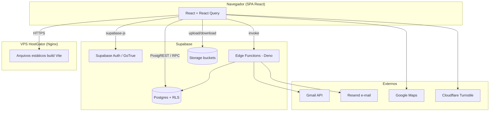
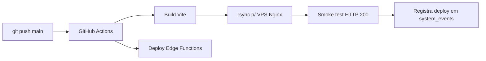

# Arquitetura

## Visão geral

GD Manager Energy é um **SaaS multi-tenant** para homologação de projetos
fotovoltaicos. A arquitetura é **serverless-first**: não existe um servidor de
aplicação próprio. O front-end é uma SPA estática e todo o back-end é o
**Supabase** (Postgres gerenciado + Auth + Storage + Edge Functions).

## Camadas e responsabilidades

1. **Apresentação (SPA)** — `src/pages` e `src/components`. Renderização,
   navegação (React Router) e estado de servidor via React Query. Sem regra de
   negócio sensível — o cliente é considerado não confiável.
2. **Acesso a dados (hooks)** — `src/hooks/use*.ts`. Cada hook encapsula queries
   e mutations do Supabase para uma entidade. É a fronteira entre UI e dados.
3. **Lógica de servidor**:
   - **RPCs SQL** (`SECURITY DEFINER`) para agregações e operações que exigem
     privilégio controlado (ex.: console master, cálculo de valor, tokens
     públicos).
   - **Edge Functions (Deno)** para o que precisa de segredo ou serviço externo
     (criação de usuários com `service_role`, envio de e-mail, scan de Gmail,
     autocadastro de tenant).
4. **Persistência** — Postgres com **RLS** como mecanismo central de
   autorização. Storage para arquivos (documentos, templates, logos).

## Multi-tenancy

- Cada empresa assinante é um registro em `tenants`. Todo dado de negócio
  carrega `tenant_id`.
- **Políticas RLS RESTRICTIVE** (`tenant_isolation`) garantem que cada usuário
  só enxergue linhas do seu tenant. RESTRICTIVE porque combina com as políticas
  PERMISSIVE por papel via `AND` — nenhuma política de papel pode "furar" o
  isolamento.
- Helpers no banco: `get_user_tenant_id(uuid)`, `is_master(uuid)`,
  `tenant_has_access()`, `has_role(uuid, role)`.
- O **master** (GD Manager) administra a plataforma pelo console `/painel`, via
  RPCs `SECURITY DEFINER` gated por `is_master`. O master **não** enxerga dados
  de tenants no painel comum — as políticas de isolamento não têm bypass de
  master (decisão de segurança). Ver [security.md](security.md).
  Seções do console: Visão geral, Tenants, Acessos, Uso da plataforma,
  Financeiro, **Agentes de IA** (extrato de uso: saldo estimado em USD =
  recargas lançadas − custo por tokens reais de cada chamada; quebra por
  agente/tenant/dia; alerta de reabastecimento; RPCs `console_ai_usage`,
  `console_ai_add_credit`, `console_ai_delete_credit`; tabela
  `ai_credit_entries` sem policies — acesso só via essas RPCs) e
  Monitoramento.

## Comunicação entre módulos

Os módulos não se chamam diretamente no front-end; compartilham o **banco** como
integração. Ex.: o módulo de Projetos grava `project_general_data`; o módulo
Financeiro reage via trigger `fn_set_project_value`; Notificações disparam via
`dispatchNotification` no evento de criação. Regras de negócio que precisam ser
inquebráveis vivem em **triggers/RPCs no banco**, não no cliente.

## Padrões adotados

- **Fonte única de verdade** para variáveis de template do projeto:
  `src/utils/projectValues.ts` (`buildProjectValues`) — usada tanto por "Gerar
  documento" quanto pelo Pacote do Projetista.
- **Feature-by-hook**: uma entidade = um hook em `src/hooks`.
- **RLS como autorização**, não checagem no cliente. O cliente pode esconder
  botões, mas a barreira real é o banco.
- **Auditoria por trigger** (`fn_audit_row`) grava em `system_events` toda
  criação/alteração/exclusão nas tabelas sensíveis — independe da origem.
- **Deploy imutável**: cada push na `main` gera build e publica; a publicação é
  registrada em `system_events` (kind `deploy`).

## Fluxo de deploy

### `/assets` não é apagado no deploy

O rsync roda em **duas passadas**: `dist/assets/` sobe **sem** `--delete` (as
versões antigas ficam no ar) e o resto do site espelha o build com `--delete`,
excluindo `assets/`. Um `find -mtime +30 -delete` limpa o que já está velho.

O motivo é concreto: os arquivos de `/assets` têm hash no nome e partes do app
carregam **sob demanda** (o gerador de PDF, o leitor de PDF, o html2pdf).
Apagando os assets antigos, quem estava com a aba aberta quando saiu uma versão
nova continua pedindo o pedaço antigo e recebe **404** — a funcionalidade morre
sem erro visível. Foi o que derrubou o "Baixar PDF" do diagrama em jul/2026.
Ver [modules/diagrams](../modules/diagrams/overview.md).

Ver também: [tech-stack.md](tech-stack.md) · [security.md](security.md) ·
[integrations.md](integrations.md).
